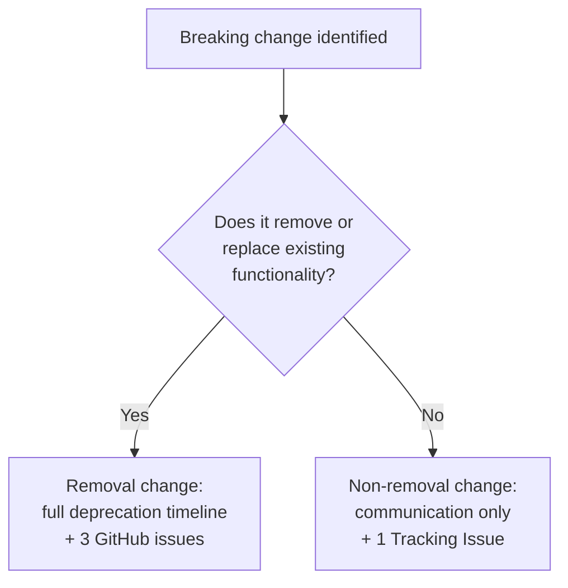

# Breaking Change Process

This is a practical, action-oriented guide to making a breaking change in EDK II. It distills the full policy into the
concrete steps each role needs to follow.

For the complete policy, including rationale, taxonomy details, and additional cases, see
[RFC 0003: Breaking Change and Release Process for EDK II](../../rfc/text/0003-edk2-breaking-change-and-release-process.md).

```admonish warning title="RFC is the authoritative source"
The RFC is the authoritative source for the policy. In case of any conflict between this guide and the RFC, the RFC
takes precedence and the document should be updated accordingly.
```

```admonish tip title="Just need the checklist?"
Jump to the [Contributor Checklist](#contributor-checklist). Reviewers and maintainers have their own checklists
further down.
```

## Step 1: Do You Have a Breaking Change?

A change is breaking if it can break a downstream platform consumer. Breaking changes fall into three categories:

| Category         | Breaks the platform by...                           | Common examples                                                    |
|------------------|-----------------------------------------------------|--------------------------------------------------------------------|
| **Source-Level** | Causing a build-time (e.g. compile or link failure) | Changing/removing an API, library class, PCD, GUID, or structure   |
| **Behavioral**   | Changing runtime behavior without a build failure   | Changing a default, stricter validation, new error codes, timing   |
| **Build-System** | Changing tooling, build config, or CI dependencies  | New tool version, DSC/INF/DEC syntax, build flags, submodule bumps |

If your change fits none of these, it is likely not breaking and this process does not apply.

For the full list of subcategories and examples, see the
[Breaking Change Taxonomy](../../rfc/text/0003-edk2-breaking-change-and-release-process.md#breaking-change-taxonomy).

```admonish note title="Prefer to avoid the break"
Before proceeding, check whether the change can be made non-breaking, for example with an additive API, a
backward-compatible PCD default, a compatibility wrapper, or by preserving a GUID value. See
[Strategies to Avoid Breaking Changes](../../rfc/text/0003-edk2-breaking-change-and-release-process.md#strategies-to-avoid-breaking-changes).
```

## Step 2: Is It a Removal or a Non-Removal Change?

This decision determines how much process you must follow.

- **Removal change**: Removes or replaces existing functionality (for example, removing an API or PCD). Must follow the
  full [deprecation timeline](#the-deprecation-timeline-removal-changes) and requires three GitHub issues.
- **Non-removal change**: Only adds to or alters functionality without removing it (for example, adding a required
  library class dependency). Requires communication but **no** deprecation timeline and only **one** GitHub issue.



## Step 3: Follow the Steps for Your Case

### Contributor Checklist

Do all of the following in the PR that introduces the change:

1. **Classify** the change: category (source-level, behavioral, build-system) and removal vs non-removal.
2. **Add or update** the entry in `BREAKING-CHANGES.md` at the root of the edk2 repository (see
   [The BREAKING-CHANGES.md Entry](#the-breaking-changesmd-entry)).
3. **Create the GitHub issues** for your case (see [GitHub Issues and Labels](#github-issues-and-labels)) and set their
   milestones.
4. **Label the PR** with `impact:breaking-change` and link the **Tracking Issue** from the PR description
   (the "Integration Instructions" section).
5. **For removal changes**, structure the change as two PRs: a first PR where old and new coexist, and a later PR that
   removes the old code. Keep the deprecated item functional in the first PR.
6. **Check edk2-platforms**: search for usages of the affected API/PCD/GUID/pattern. If affected, submit a companion PR
   (see [edk2-platforms Companion PRs](#edk2-platforms-companion-prs)).

### Reviewer Checklist

1. Confirm the classification and removal vs non-removal decision are correct.
2. Treat the `BREAKING-CHANGES.md` entry as a first-class part of the review: verify it is complete and that the
   migration guidance is specific and actionable.
3. Confirm the required GitHub issues, labels, milestones, and the Tracking Issue link are present.

### Maintainer Checklist

1. Ensure all process requirements above are met before approving.
2. Verify the edk2-platforms companion PR exists when applicable.
3. Track deprecation and removal progress via the GitHub issues and ensure state transitions are reflected in
   `BREAKING-CHANGES.md`.

## The BREAKING-CHANGES.md Entry

Every breaking change PR adds or updates one entry in `BREAKING-CHANGES.md`. This file is the single source for the
breaking change section of the stable tag release notes, so the entry must stand on its own.

Each entry must include:

- A short title.
- A **Status**: `Announced`, `Deprecation Active`, or `Removed`.
- Links to the associated GitHub issues (Removal Issue omitted for non-removal changes).
- The **type** of change, including its subcategory from the taxonomy.
- **Why it changed** (motivation).
- **What replaces it** (or why nothing does).
- **Migration guidance**: specific, actionable steps a platform owner takes to adopt the change.
- **Removal changes only**: what is deprecated and the earliest stable tag at which removal may occur.
- Breaking conditions, when the change only affects certain configurations.
- A companion edk2-platforms PR link, when applicable.

Update the same entry as the change progresses. For example, the PR that removes the deprecated item sets the entry's
`Status` to `Removed`. Entries are never deleted, they remain as a historical record.

The above information is not in the exact format that should be used. For the full entry format and examples, see
[The BREAKING-CHANGES.md File](../../rfc/text/0003-edk2-breaking-change-and-release-process.md#breaking-changesmd-file).

## GitHub Issues and Labels

The GitHub issues exist for process tracking (labels, milestones, subissue relationships, PR linkage). Keep their
descriptions minimal. The detailed documentation is kept in `BREAKING-CHANGES.md`.

| Change type      | Issues to create                          | Labels                                                              |
|------------------|-------------------------------------------|---------------------------------------------------------------------|
| **Non-removal**  | Tracking Issue                            | `deprecation:tracking`                                              |
| **Removal**      | Tracking Issue + Deprecation + Removal    | `deprecation:tracking`, `deprecation:active`, `deprecation:removal` |

For removal changes, the Deprecation and Removal Issues are subissues of the Tracking Issue. Set milestones as follows:

- **Deprecation Issue**: the stable tag milestone when the deprecation PR merges.
- **Removal Issue**: the stable tag milestone when the removal PR merges.
- **Tracking Issue**: the milestone when all work for the change is complete.

For the required content of each issue, see
[GitHub Issue Templates](../../rfc/text/0003-edk2-breaking-change-and-release-process.md#github-issue-templates).

## The Deprecation Timeline (Removal Changes)

Removal changes coexist with their replacement for one stable tag before removal. `N` is the stable tag where the
deprecation active period begins.

```text
  Announced (pre-N)        Stable Tag N                  Stable Tag N+1
  documented / approved    Deprecation Active            Deprecation Conclusion
|---------------------- |-- old + new coexist -------- |-- old removed -------->
                           (compatibility window)         (earliest removal)
```

- **Announced (pre-N)**: Issues and the `BREAKING-CHANGES.md` entry exist. The deprecation PR has not merged.
- **Stable Tag N**: The deprecation PR merges. Old and new coexist. Platforms migrate during this window.
  - Note: The deprecation PR may be created and merged within the same stable tag as the announcement.
- **Stable Tag N+1**: The earliest stable tag at which the deprecated item may be removed.

The state of a removal change is derived from which issues are open. See
[Breaking Change States](../../rfc/text/0003-edk2-breaking-change-and-release-process.md#breaking-change-states).

```admonish warning title="Freeze periods can delay removal"
The deprecation PR must merge **before** the soft freeze to count for the current stable tag. If it merges during the
soft freeze or later, the deprecation active period begins after the stable tag, delaying removal by one stable tag.
See [Breaking Changes and Freeze Periods](../../rfc/text/0003-edk2-breaking-change-and-release-process.md#breaking-changes-and-freeze-periods).
```

## edk2-platforms Companion PRs

When a breaking change affects edk2-platforms:

1. Submit a companion PR to edk2-platforms that resolves the break.
2. Reference the edk2 PR from the companion PR description.
3. Coordinate so the companion PR is ready to merge when the edk2 PR merges, minimizing the window where edk2-platforms
   is broken against edk2 `master`.

The approving maintainer verifies the companion PR exists. See
[Cross-Repository Coordination: edk2-platforms](../../rfc/text/0003-edk2-breaking-change-and-release-process.md#cross-repository-coordination-edk2-platforms).

## For Platform Owners

- On each stable tag, read the release notes and follow the migration guidance in the referenced `BREAKING-CHANGES.md`
  entries.
- When integrating from `master` between stable tags, read `BREAKING-CHANGES.md` at the commit you integrate to see the
  current breaking changes and their state.
