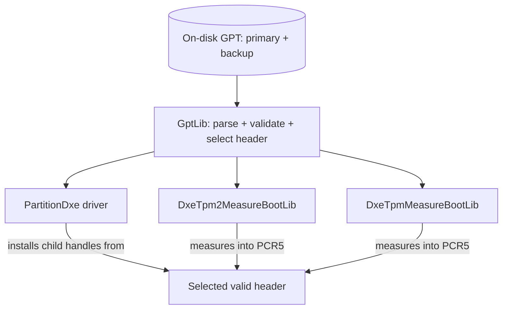

# RFC: Shared GPT Parser Library (GptLib) for Consistent Partition Parsing and Measurement

## Metadata

- **RFC Number**: TBD
- **Title**: Shared GPT Parser Library (GptLib) for Consistent Partition Parsing and Measurement
- **Status**: Draft
- **Author**: Richard Lyu (`@r1chard-lyu`)

## Change Log

- 2026-07-14: Initial RFC created. Incorporate review feedback from the implementation PR
  ([tianocore/edk2#12745](https://github.com/tianocore/edk2/pull/12745)): note the RFC 0003 breaking-change impact of
  the new library class dependency.

## Motivation

CVE-2024-13745 (reported via oss-sec, [ref](https://seclists.org/oss-sec/2026/q2/727)) describes a divergence
between the GUID Partition Table (GPT) that `SecurityPkg/DxeTpm2MeasureBootLib` measures into PCR[5] and the GPT that
`MdeModulePkg/Universal/Disk/PartitionDxe` actually parses and uses to install partition child handles. Because the
two components read and validate the on-disk GPT with different, independently maintained code paths, an attacker can
craft a disk whose measured partition table is not the partition table the firmware subsequently trusts and boots
from. This breaks the security property that PCR[5] is supposed to attest: that the measured partition layout is the
one in use.

The root cause is duplicated, drifting GPT parsing logic:

- `PartitionDxe` has the most complete parser: it checks the header signature, header CRC32, `MyLBA`, the
  partition-entry-array CRC32, and entry-array size overflow, and it falls back to the backup GPT when the primary is
  invalid.
- `DxeTpm2MeasureBootLib` performed its own field validation via `Tpm2SanitizeEfiPartitionTableHeader()` with no
  header CRC32, no entry-array CRC32, and no backup fallback.
- `DxeTpmMeasureBootLib` (the SHA-1/TPM 1.2 path) read the primary header directly from LBA 1 with field checks only:
  no header CRC32, no entry-array CRC32, and no backup fallback. The CVE tracking issue lists both measure-boot
  libraries as affected.

Any component that parses the same on-disk GPT layout must reach the same accept/reject decision and select the same
header. Today there is no shared, authoritative implementation to guarantee that, so the parse path and the measure
path can and do disagree.

## Technology Background

- **GPT (GUID Partition Table)**: The partitioning scheme defined in the UEFI Specification (a primary header at
  LBA 1, a backup header at the last LBA, a partition entry array, and CRC32 protection over the header and the entry
  array). GPT data is untrusted external input read from potentially attacker-controlled media.
- **Measured Boot / TPM PCR[5]**: UEFI firmware measures the GPT into PCR[5] so that a verifier can attest the disk
  partition layout. The measured value must correspond to the partition table the firmware actually uses.
- **TOCTOU-style divergence**: When two code paths read and validate the same external data independently, they can
  reach different conclusions, which is the class of bug CVE-2024-13745 falls into.
- **EDK II library classes**: EDK II shares code through library classes declared in a package `.dec` file and
  resolved to concrete instances per platform in `.dsc`/`.dsc.inc` files.

## Goals

1. Provide a single, authoritative GPT parsing and validation implementation shared by all consumers.
2. Guarantee that the GPT measured into PCR[5] is selected by the same shared parser and validation logic that
   `PartitionDxe` uses.
3. Restore and centralize the UEFI-mandated GPT header validation that the measurement path had lost.
4. Preserve `PartitionDxe`'s existing accept behavior for well-formed disks (no regression for valid media).
5. Provide host-based unit tests that cover both valid and malformed GPT input.

## Requirements

1. The shared parser must live in `MdeModulePkg` (where `PartitionDxe` and its GPT logic already reside) and be
   exposed as a reusable library class.
2. The parser must validate GPT headers against UEFI-mandated constraints, including CRC32 of the header and the
   partition-entry array, and support primary/backup header selection.
3. `PartitionDxe`, `DxeTpm2MeasureBootLib`, and `DxeTpmMeasureBootLib` must all consume the shared parser so that the
   parse and measure paths cannot diverge.
4. The change must not alter `PartitionDxe`'s handling of valid GPT disks beyond tightening rejection of malformed
   headers.
5. Platforms must be able to pull in the new library instance through a reusable DSC include.

## UEFI/PI Specification Impact

- No impact.

## Backward Compatibility

- `DxeTpm2MeasureBootLib` and `DxeTpmMeasureBootLib` now depend on `GptLib`. Platforms that build these libraries
  must resolve the `GptLib` library class in their DSC (see Migration/Adoption Plan). Without it, the affected
  platform build will fail to resolve the new library class. This is a build-breaking change under the EDK II
  Breaking Change and Release Process (RFC 0003) and will be handled accordingly (breaking-change documentation with
  integration instructions).
- As suggested by @lgao4 in the implementation PR review, adding `MdeModuleLibs.dsc.inc` and having platform DSCs
  include it can mitigate future breaking changes from `MdeModulePkg` library additions.

## Platform/Package Impact

- **MdeModulePkg**: New `GptLib` library class, instance, host unit tests, `MdeModuleLibs.dsc.inc`.
  `PartitionDxe` refactored to consume `GptLib`.
- **SecurityPkg**: `DxeTpm2MeasureBootLib` and `DxeTpmMeasureBootLib` refactored to consume `GptLib`; both `.inf`
  files gain the dependency; `SecurityPkg.dsc` resolves it.
- **Platform packages consuming the measure-boot libraries**: `ArmVirtPkg`, `EmulatorPkg`, `OvmfPkg` (all variants:
  AmdSev, Bhyve, CloudHv, IntelTdx, LoongArchVirt, Microvm, OvmfPkgIa32X64, OvmfPkgX64, OvmfXen, RiscVVirt), and
  `UefiPayloadPkg` are updated to `!include MdeModulePkg/MdeModuleLibs.dsc.inc` to obtain the `GptLib` instance.
- **Downstream/out-of-tree platforms**: Must add the `GptLib` resolution if they build `PartitionDxe` or either
  measure-boot library (see Migration/Adoption Plan).

## Unresolved Questions

- Is `MdeModuleLibs.dsc.inc` the preferred long-term mechanism for distributing common `MdeModulePkg` library
  resolutions?
  - As noted by @os-d in the implementation PR review, `.dsc.inc` files can become convoluted, are easily overridden
    by accident, and would be needed per package. The EDK II build specification already defines (but BaseTools does
    not implement) a "recommended library instance" mechanism where a default instance is chosen when a DSC provides
    no mapping; an implementation is proposed by @os-d in
    [tianocore/edk2#12788](https://github.com/tianocore/edk2/pull/12788). The two mechanisms are potentially
    complementary (the fallback only applies when a DSC has no mapping), and `GptLib` consumer INFs could adopt the
    recommended instance as a follow-up once that lands.

## Prior Art/Related Work

- The GPT parsing and validation logic already existed in `MdeModulePkg/Universal/Disk/PartitionDxe/Gpt.c`; this RFC
  extracts and shares it rather than inventing new logic.
- `DxeTpm2MeasureBootLib` previously used `Tpm2SanitizeEfiPartitionTableHeader()` for standalone validation; this RFC
  consolidates that responsibility.
- The general pattern of "measure exactly what you use" is standard practice for TPM measured boot to avoid
  TOCTOU-style attestation gaps.
- Original CVE report: <https://seclists.org/oss-sec/2026/q2/727>.

## Alternatives

### Alternative 1: Patch each measure-boot library independently to add the missing checks

- **Pros**: Smaller diff; no new library class.
- **Cons**: Leaves three independent GPT parsers that will drift again; does not structurally guarantee the measured
  table equals the used table. Reintroduces the exact class of bug over time.
- **Why not chosen**: It treats the symptom, not the root cause (duplicated, drifting parsers).

### Alternative 2: Have the measure-boot libraries call into PartitionDxe directly

- **Pros**: Single source of parsing truth.
- **Cons**: `PartitionDxe` is a driver, not a library; measure-boot libraries would gain an inappropriate runtime
  dependency on a driver and its handle-installation behavior. Poor layering.
- **Why not chosen**: Wrong module boundary; a library class is the correct EDK II mechanism for shared logic.

## Implementation Design

A reference implementation is available as [tianocore/edk2#12745](https://github.com/tianocore/edk2/pull/12745).

### Architecture Overview



All consumers route GPT parsing, validation, and header selection through the single `GptLib` implementation, so the
header used for partition child handles is the same header measured into PCR[5].

### Detailed Design

**New library class `GptLib`** (`MdeModulePkg/Include/Library/GptLib.h`), public API:

```c
typedef struct {
  BOOLEAN    OutOfRange;
  BOOLEAN    Overlap;
  BOOLEAN    OsSpecific;
} EFI_PARTITION_ENTRY_STATUS;

// Read the GPT header at Lba and validate it (untrusted input).
BOOLEAN
PartitionValidGptTable (
  IN  EFI_BLOCK_IO_PROTOCOL       *BlockIo,
  IN  EFI_DISK_IO_PROTOCOL        *DiskIo,
  IN  EFI_LBA                     Lba,
  OUT EFI_PARTITION_TABLE_HEADER  *PartHeader
  );

// Restore the partition table to its alternate place (primary <-> backup).
BOOLEAN
PartitionRestoreGptTable (
  IN  EFI_BLOCK_IO_PROTOCOL       *BlockIo,
  IN  EFI_DISK_IO_PROTOCOL        *DiskIo,
  IN  EFI_PARTITION_TABLE_HEADER  *PartHeader
  );

// Validate each partition entry and report status (untrusted input).
VOID
PartitionCheckGptEntry (
  IN  EFI_PARTITION_TABLE_HEADER  *PartHeader,
  IN  EFI_PARTITION_ENTRY         *PartEntry,
  OUT EFI_PARTITION_ENTRY_STATUS  *PEntryStatus
  );
```

**Validation restored/centralized** in `PartitionValidGptTable()`. In addition to the existing signature, header
CRC32, `MyLBA`, entry-array CRC32, and entry-array size overflow checks, the header is now rejected unless:

- `Header.Revision == GPT_HEADER_REVISION_V1`;
- `HeaderSize` is at least the 92-byte minimum;
- `NumberOfPartitionEntries` is non-zero;
- `SizeOfPartitionEntry == 128 * 2^n`;
- `PartitionEntryLBA * BlockSize` does not overflow.

The "entries lie before `FirstUsableLBA`" rule is intentionally omitted because this routine also validates the backup
header, whose entry array follows the usable region.

**PartitionDxe change**: `PartitionInstallGptChildHandles()` aborts GPT processing when restoring the primary from the
backup, or re-validating the restored primary, fails — so partitions are only ever parsed from a validated primary
header. The backup-recovery branch is unchanged (the primary is already validated there).

**Measure-boot libraries**: `DxeTpm2MeasureBootLib` and `DxeTpmMeasureBootLib` select the header to measure via
`GptLib`: validate the current primary GPT, or when invalid, validate the backup and the header at its `AlternateLBA`.
PCR[5] is not extended if no valid header can be selected.

**Distribution**: `MdeModulePkg/MdeModuleLibs.dsc.inc` provides the `GptLib` resolution for platforms via
`!include`.

### Code Examples

Platform DSC obtains the library instance through the shared include:

```ini
[LibraryClasses]
  !include MdeModulePkg/MdeModuleLibs.dsc.inc
  # provides: GptLib|MdeModulePkg/Library/GptLib/GptLib.inf
```

A consumer selecting the GPT header to measure:

```c
EFI_PARTITION_TABLE_HEADER  PrimaryHeader;

if (PartitionValidGptTable (BlockIo, DiskIo, PRIMARY_PART_HEADER_LBA, &PrimaryHeader)) {
  // Measure/parse PrimaryHeader.
} else if (PartitionValidGptTable (BlockIo, DiskIo, BackupLba, &BackupHeader) &&
           PartitionValidGptTable (BlockIo, DiskIo, BackupHeader.AlternateLBA, &PrimaryHeader)) {
  // Measure/parse the recovered primary.
} else {
  // No valid header: do not extend PCR[5] / install no child handles.
}
```

## Testing Strategy

### Build regression

- Built with GCC across 8 platforms (X64, IA32, AARCH64, RISCV64): OvmfPkgX64, IntelTdxX64, MicrovmX64, ArmVirtQemu,
  RiscVVirtQemu, etc. All compiled successfully.

### Integration test (QEMU + OVMF + swtpm, `-D TPM2_ENABLE=TRUE`)

- Attack disk - a GPT image whose primary partition-entry-array CRC is corrupted (one byte flipped at offset 1152)
  while the backup stays valid, attached as a read-only virtio-blk drive so the primary table cannot be restored.
  Confirmed fail-closed: fw debug log shows repeated "Restore primary partition table error", GPT parsing aborts at
  the new `goto Done`, and no partition child handles are created. Pre-fix code fell through and parsed the invalid
  primary header.
- Normal disk - a valid, writable GPT image. Boots normally: `map -r` in the UEFI Shell maps the GPT partition
  (HD(1,GPT,...)), the debug log reports "Valid primary and Valid backup partition table" with no restore errors.
  Confirms no regression.

### Host Based Unit Test

- Coverage: Validated GptLib parsing logic against valid tables, corrupted CRCs, and malformed GPT scenarios.

  ```shell
  build -p MdeModulePkg/Test/MdeModulePkgHostTest.dsc -a X64 -t GCC -b NOOPT \
    -m MdeModulePkg/Library/GptLib/UnitTest/GptLibUnitTestHost.inf
  ./Build/MdeModulePkg/HostTest/NOOPT_GCC/X64/GptLibUnitTestHost
  ```

## Migration/Adoption Plan

1. **Phase 1 — Add GptLib**: Add the `GptLib` library class, instance, unit tests, and `MdeModuleLibs.dsc.inc`;
   refactor `PartitionDxe` to consume it (behavior preserved for valid disks).
2. **Phase 2 — Consume in SecurityPkg**: Switch `DxeTpm2MeasureBootLib` and `DxeTpmMeasureBootLib` to `GptLib` and
   resolve the class in `SecurityPkg.dsc`.
3. **Phase 3 — Update in-tree platforms**: Add the `MdeModuleLibs.dsc.inc` include to `ArmVirtPkg`, `EmulatorPkg`,
   all `OvmfPkg` variants, and `UefiPayloadPkg`.
4. **Phase 4 — Downstream adoption**: Out-of-tree platforms that build `PartitionDxe` or the measure-boot libraries
   add the `GptLib` resolution to their DSC. Recommended action: `!include MdeModulePkg/MdeModuleLibs.dsc.inc`.

**Risk mitigation**: The only build-breaking change is the new link dependency; it surfaces immediately at build time
with a clear unresolved-library-class error and is fixed by the one-line include.

## Guide-Level Explanation

### For Package Developers

Use `GptLib` whenever you need to parse or validate on-disk GPT data. Call `PartitionValidGptTable()` to read and
validate a header at a given LBA (it handles the untrusted-input validation for you), fall back to the backup header
via its `AlternateLBA` when the primary is invalid, and use `PartitionCheckGptEntry()` for per-entry status. Do not
write a private GPT parser — that is exactly the duplication CVE-2024-13745 exploited.

### For Platform Developers

If your platform builds `PartitionDxe` or either TPM measure-boot library, add:

```ini
!include MdeModulePkg/MdeModuleLibs.dsc.inc
```

to your DSC `[LibraryClasses]` section to resolve `GptLib`. No configuration options are introduced. Be aware that a
device with an unrecoverable primary GPT will now install no partition child handles rather than using an invalid
table.

### For End Users (if applicable)

On well-formed disks there is no visible change. On disks with a corrupted or malicious GPT that cannot be validated,
the firmware no longer exposes partitions from an invalid table, and measured boot (PCR[5]) now reflects exactly the
partition table the firmware uses — closing the attestation gap described by CVE-2024-13745.
