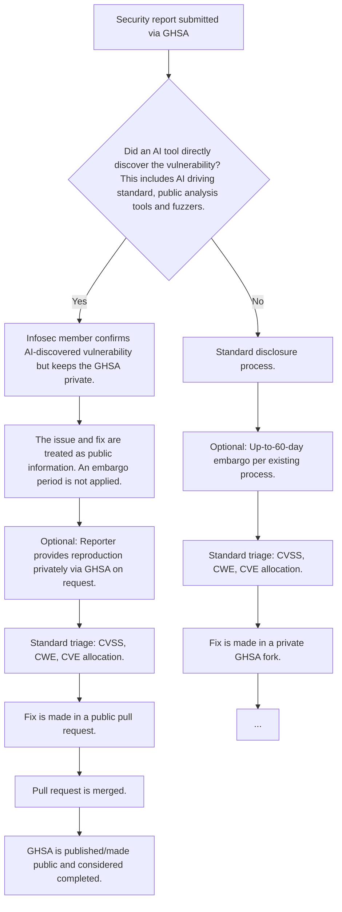

# RFC: AI-Discovered Security Vulnerability Reporting Policy

## Metadata

- **RFC Number**: TBD
- **Title**: AI-Discovered Security Vulnerability Reporting Policy
- **Status**: Draft

## Change Log

- 2026-09-21: Initial RFC created
- 2026-10-07: Move the `Assisted-by` tag content from "Unresolved Questions" to "Motivation".

## Motivation

AI tools are increasingly capable of reviewing source code and identifying potential vulnerabilities, including in EDK
II and related TianoCore repositories (e.g. `edk2-platforms`). Several major open source projects have reported a
measurable rise in AI-discovered vulnerability research, such as
[curl](https://daniel.haxx.se/blog/2025/07/14/death-by-a-thousand-slops/) and the
[Linux kernel](https://docs.kernel.org/process/security-bugs.html#what-qualifies-as-a-security-bug). This has been
observed in EDK II as well.

Overall, if the reports are legitimate and actionable, this can greatly improve project security. Today's
[security reporting guidance](../../security/processes/reporting_security_issues.md) already asks reporters to analyze
AI-generated results before submitting a report, since raw scanner/tool output is not by itself sufficient to justify a
security advisory. That guidance addresses report _quality_, but it does not address disclosure _timing_. Specifically,
it does not describe how a vulnerability that was directly identified by an AI tool should be handled with respect to
TianoCore's standard embargo process (see
[GHSA Process](../../security/processes/ghsa_github_security_advisories_process_draft.md), which defines a 60-day
default embargo).

Treating an AI-discovered vulnerability as something that can safely stay confidential under a multi-week embargo gives
a false sense of security as the same widely available AI tools and models can be, and often are, applied independently
by multiple parties against the same public `edk2`/`edk2-platforms` source at around the same time. Holding such a
report under a long embargo mainly delays a public fix while doing little to reduce the number of parties who may
already be aware of the issue. It has also been observed that because AI tool capabilities have increased rapidly
without a similar rate of fixes, there is now "low hanging fruit" in edk2 that comes up frequently in security reports
which leads to an increase in duplicate reports and effort spent coordinating fixes.

This RFC updates the TianoCore security process to clearly account for security bugs found with AI assistance so that
they can be triaged, disclosed, and fixed consistently and efficiently, while preserving TianoCore's existing
obligations as a [CVE Numbering Authority (CNA)](https://cve.mitre.org/cve/cna.html). Part of the motivation for AI
disclosure is also derived from existing attribution conventions in large open-source projects such as the Linux kernel,
which tracks AI's role in the development process with an
[`Assisted-by` tag](https://docs.kernel.org/process/coding-assistants.html#attribution) tag. Note that TianoCore
currently does not require such a tag in commit messages for AI-assisted contributions and that policy is not modified
by this RFC.

To be clear, the AI-discovered policy is not intended to diminish the work a human researcher contributed to finding the
issue and credit is assigned appropriately. What the process encourages is transparent disclosure that can lead to a
much more rapid resolution path (months to days) resolution for the issue with significantly less overhead for everyone
involved including InfoSec, the reporter, maintainers, and the broader community. Simply put, an AI-discovered issue not
disclosed will take significantly longer to be acknowledged, addressed, and resolved. That is the reality of the limited
resources available to handle incoming security reports.

In the past, there has been concern that such an approach would reveal zero-day vulnerabilities before they could be
responsibly disclosed and mitigated. A large number of incoming GHSA reports are discoverable using 1-2 sentence
prompts, on models readily available for months now, a few minutes of time, <$10 USD, and no firmware domain expertise.

## Technology Background

AI coding and security research tools are now commonly used to scan source code and identify potential vulnerabilities,
including memory-safety issues (buffer overflows, integer overflows, use-after-free) that are common In this context, AI
coding and research tools includes AI-discovered vulnerabilities driving common, public tools like
[libfuzzer](https://llvm.org/docs/LibFuzzer.html). Similar classes of issues are found with static analysis tools like
Clang Static Analyzer, CodeQL, Coverity, etc. and fixed publicly today in EDK II.

While TianoCore does not currently have a project-wide AI contribution or attribution policy, this RFC recommends
reporters identify the AI tool or model used directly in the vulnerability report (see [Requirements](#requirements)).

TianoCore has two existing security processes that this RFC must account for:

- TianoCore is a CNA and generally must issue a CVE for qualifying `edk2` issues (a "Must" per the existing
  [Reporting Security Issues](../../security/processes/reporting_security_issues.md) guidance).
- TianoCore's documented default embargo period is 60 days (per the
  [GHSA Process](../../security/processes/ghsa_github_security_advisories_process_draft.md)). Note that this makes the
  "false sense of confidentiality" more pronounced for Tianocore than other projects with shorter embargo periods.

## Goals

1. Define a clear policy for security bugs found with AI tools in `edk2`, `edk2-platforms`, and other TianoCore
   repositories that use the GitHub Security Advisory (GHSA) process.
2. Avoid embargo delays for AI-discovered reports that are likely to surface independently, elsewhere, during the
   embargo period.
3. Incorporate the policy into the existing
   [Reporting Security Issues](../../security/processes/reporting_security_issues.md) page, which is the wiki page
   reporters and maintainers currently reference.
4. Set expectations for the completeness of AI-discovered reports so the Infosec group can triage them efficiently,
   consistent with the existing requirement that raw tool output alone is not sufficient.
5. Preserve TianoCore's CNA/CVE issuance obligations and existing CVSS scoring practice for all qualifying issues,
   regardless of how the issue was found.

## Requirements

1. The reporting guidance must state that a vulnerability directly discovered by an AI tool is treated as public
   information once reported, and is not eligible for the standard 60-day embargo.
2. Reporters should still avoid publishing detailed reproduction steps or exploit code publicly, but must be prepared to
   provide the information privately, through the GHSA, on request. The GHSA remains private until the fix is merged
   into the main (`master`) branch.
3. Reports must state the affected version or commit hash and confirm the issue still reproduces there.
4. Reports must state whether the finding was reproduced and how, or clearly state that it was not reproduced. This is
   in addition to, not a replacement for, the existing proof-of-concept/exploit code guidance already in
   [Reporting Security Issues](../../security/processes/reporting_security_issues.md).
5. Reports must name the specific package, file, function, and lines involved, and describe the actual impact in
   practical terms instead of speculative language.
6. Reports must lead with a concise summary before any supporting detail.
7. Reports must state which AI tool or model was used to discover the issue.
8. If the AI tool did not directly discover the vulnerability, and was only used to help generate reproduction code,
   test cases, or supporting analysis for an issue found through other means, the report follows TianoCore's standard
   disclosure and embargo process unchanged. Note that AI using public analysis tools or fuzzers to assist in finding
   vulnerabilities still falls under an AI-discovered report.
9. Issues that qualify for a CVE must still receive one, and CVSS scoring is still requested from the reporter,
   regardless of whether the issue was AI-discovered.

## UEFI/PI Specification Impact

None. This RFC is a process and documentation change to TianoCore's security reporting policy. It does not affect UEFI
or PI specification behavior and does not require specification changes.

## Backward Compatibility

This is an additive documentation/process change with no impact on existing code, builds, or released firmware.

- **Breaking changes**: None.
- **Migration path**: N/A. Existing in-flight GHSAs continue under the process in effect when they were opened. The
  Infosec group may, at its discretion, apply the new guidance to an in-flight report if the reporter agrees.
- **Deprecation**: None. The existing guidance to analyze AI-generated results before submitting a report is retained
  and complemented, not replaced.
- **Compatibility layer**: Not applicable.

## Platform/Package Impact

None directly as this RFC does not modify any EDK II package code. It applies to the security reporting process across
all TianoCore repositories that use GitHub Security Advisories, including `edk2` and `edk2-platforms`.

## Unresolved Questions

- Does the CNA relationship impose any timing constraints on public disclosure that would conflict with treating an
  AI-discovered issue as public immediately upon report? This should be confirmed with TianoCore Infosec.

Note: These questions will be resolved during the RFC review process.

## Prior Art/Related Work

- The
  [Linux kernel security bug documentation](https://docs.kernel.org/process/security-bugs.html#what-qualifies-as-a-security-bug)
  is the original inspiration for the general policy approach taken in this RFC.
- I created a similar policy in the Open Device Partnership (ODP) organization that I based this RFC on:
  [ODP RFC 0054: AI Security Bug Reporting Policy](https://github.com/OpenDevicePartnership/governance/blob/main/rfc/0054-ai-security-policy.md).
- The [Reporting Security Issues](../../security/processes/reporting_security_issues.md) page already provides some
  guidance to analyze AI-generated results and include proof-of-concept/exploit code rather than raw scanner output,
  which this RFC builds on.

## Alternatives

### Alternative 1: Do not define a process for AI-discovered vulnerabilities

- **Pros**: No process change required for AI-discovered vulnerabilities.
- **Cons**:
  - Increases Infosec review overhead by defaulting every AI-discovered report into the full 60-day embargo process.
  - Risks delaying fixes for issues that are already likely to be independently rediscovered.
  - Prevents a broader audience from participating in reviewing and fixing the bug. -- **Why not chosen**: The status
    quo does not reflect how quickly AI tools have independently surfaced the same class of finding across multiple
    parties. Infosec already has duplicate findings and long review cycles, so adding AI-discovered reports on top of
    that has only increased the review burden without necessarily improving security outcomes. In addition, TianoCore
    often extends the embargo period beyond the standard 60 days and struggles to manage the incoming rate of security
    reports, a full embargo for each AI-discovered report detracts from the efficiency of the review process for all
    reported vulnerabilities.

## Implementation Design

### Architecture Overview

The flow shown here is meant to show the relevant steps in handling AI-discovered security vulnerability reports. It is
not meant to cover the entire security vulnerability reporting process.



### Detailed Design

This RFC proposes adding a new subsection to
[Reporting Security Issues](../../security/processes/reporting_security_issues.md), immediately after the existing "How
Security Issues are Evaluated" section:

```md
## Security Bugs Discovered Using AI

If an AI tool directly identifies a security vulnerability in TianoCore code, the vulnerability is treated as public
information once reported and confirmed by a member of TianoCore Infosec in the GHSA item. Any public work related to
the finding should not begin until Infosec has explicitly confirmed the report as an AI-discovered issue in the GHSA
item. This includes the AI tool using standard, public analysis tools and fuzzers to find the issue. Industry experience
has shown that vulnerabilities discovered through AI-discovered analysis often surface independently across multiple
parties within a short period of time, so delaying public acknowledgment mainly increases the period during which others
may be aware of the issue while no fix is available. Reports in this category are not eligible for the standard 60-day
embargo described in the GHSA process.

The GHSA remains private until the fix is merged into the main (master) branch.

Do not publish detailed reproduction steps or exploit methods for an AI-discovered issue outside of GHSA. It is
acceptable to note that a reproduction method exists though. Be prepared to provide it privately, through GHSA, upon
request.

If the AI tool did not directly identify the vulnerability, and was only used to generate reproduction code, test cases,
or other supporting artifacts for an issue found through other means, the report follows the standard disclosure process
described above, including the existing embargo option.

To help the Infosec group review AI-discovered reports quickly, please also include:

- The affected version or commit hash, confirmed against the current code.
- Whether you reproduced the issue and how, or a clear note that you could not.
- The specific package, file, function, and lines involved, and the actual impact rather than a speculative one.
- A short, simple summary at the top, before any supporting detail.
- The AI tool or model and version used to identify the finding.

Reports missing this information will take longer to review and may be sent back for more detail before the Infosec
group can act on them.

This is in addition to, and does not replace, the existing guidance above to analyze AI-generated results, include
proof-of-concept or exploit code where possible, and provide a CVSS score.
```

No changes to the [GHSA Process](../../security/processes/ghsa_github_security_advisories_process_draft.md) steps
themselves are proposed. AI findings are still initially submitted in GHSA and the GHSA remains private for
communication about the issue while the public fix is made. However, the embargo step is simply skipped (or shortened to
zero) for reports that fall under the new "Security Bugs Found Using AI" section and fixes are made in public pull
requests immediately instead of waiting for the embargo period to expire.

### Code Examples

Not applicable. This RFC changes documentation and process only.

## Testing Strategy

Not applicable in the traditional unit/integration test sense, since this RFC changes documentation and process rather
than code.

## Migration/Adoption Plan

1. **Phase 1**: Merge the new "Security Bugs Found Using AI" subsection into
   [Reporting Security Issues](../../security/processes/reporting_security_issues.md).
2. **Phase 2**: Announce the policy update to the TianoCore Infosec group and edk2-devel/community communication
   channels so maintainers and reviewers are aware.
3. **Phase 3**: Apply the policy to newly submitted GHSAs going forward. Existing in-flight GHSAs are not retroactively
   affected unless the reporter agrees.

## Guide-Level Explanation

### For Package Developers

If you use an AI tool to review EDK II package code and it directly discovers a vulnerability, submit it as an
[EDK II security advisory](https://github.com/tianocore/edk2/security/advisories/new) like usual, but expect the fix to
be treated as public information rather than placed under the standard embargo. Include the required information so the
Infosec group can triage it quickly.

### For Platform Developers

There is no change to how platforms consume `edk2`/`edk2-platforms` fixes.

### For End Users (if applicable)

No direct impact on firmware behavior.
