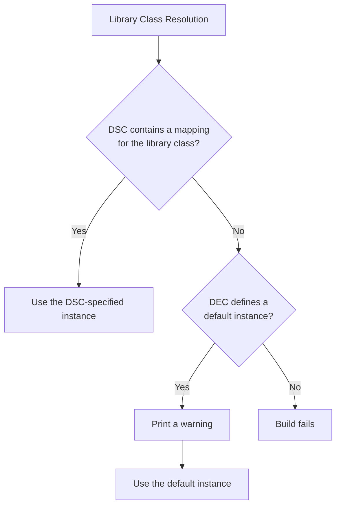

# RFC: Define Single Instance Library Class

## Metadata

- **RFC Number**: TBD
- **Title**: Define Single Instance Library Class
- **Status**: Draft

## Change Log

- 2026-07-15: Initial RFC created

## Motivation

edk2 uses one abstraction, Library Classes, for two distinct use cases:

- Single instance libraries used to share common code amongst components
- Platform abstraction points that will have many expected instances

This creates friction when adding new single instance library dependencies to edk2 modules. A platform
must update its DSC to include the new library mapping even though there is only one instance that
every platform will ever use.

## Technology Background

The
[EDK II Build spec, DEC spec, DSC spec, and INF spec](https://www.tianocore.org/tianocore-wiki.github.io/reference/specs-standards/edk_ii_documentation.html)
are all relevant to this discussion. They discuss library class declaration, dependency, and resolution.

## Goals

1. Ease platform integration by reducing breaking changes
2. Formalize the concept of single instance library classes as a first class citizen

## Requirements

1. Adding new single instance library class dependencies must not be breaking changes to a platform,
   in and of themselves.
2. Library class resolution should be easy to understand and audit

## UEFI/PI Specification Impact

This does not impact the UEFI/PI specs, but does affect the edk2 specs listed above. If this change is approved,
the relevant edk2 specs would also be updated.

## Backward Compatibility

This RFC is an attempt to prevent breaking changes from a common pattern and ease platform integration of new
edk2 stable tags.

## Platform/Package Impact

Applicable to all platforms and packages. This is a new paradigm in a fundamental build concept.

BaseTools is the package that will require code changes to support this proposal.

## Unresolved Questions

- Should this extend beyond single instance library classes and also include library classes that have a single
  expected instance per phase, e.g. XPeiLib vs XDxeLib. This could be a separate section in the DEC where each
  mapping could occur.

## Prior Art/Related Work

This problem has been mitigated in some packages by the use of DSC include files. See
[DSC Include Files](#alternative-1-dsc-include-files) for more discussion on this.

## Alternatives

Describe alternative approaches you considered and why they were not chosen:

### Alternative 1: DSC Include Files

- **Pros**:
  - No edk2 spec changes are required
  - Platform integrators are familiar with this concept
  - Allows for choosing different instances per module type and architecture
- **Cons**:
  - Add extra layers of complexity that can be difficult to reason about from viewing a DSC
  - Are allowed to contain more than just single instance library class mappings
  - Does not formalize the concept of a single instance library class
  - Every package must create a DSC include file
  - They have been observed to cause firmware issues in unexpected ways because an expected setting was not taken due
    to precedence
  - Doesn't allow choosing different defaults per consuming module
  - Adding DSC include files remains a breaking change, e.g. if XPkg has a module depending on a library class from the
  - new YPkg, it is a breaking change until a platform includes YPkg.dsc.inc
  - It is an optional mechanism that requires platform action to opt into
- **Why not chosen**: This solution makes DSCs harder to understand, doesn't formalize single instance library classes,
  which are two of the goals/requirements.

### Alternative 2: INF RecommendedInstance

The edk2 INF spec defines a
[comment](https://tianocore-docs.github.io/edk2-InfSpecification/release-1.27/3_edk_ii_inf_file_format/36_[libraryclasses]_sections.html#36-libraryclasses-sections)
that allows a module author to specify a recommended instance of a library class.

- **Pros**:
  - Already defined in the INF spec
  - Allows per module flexibility in specifying a default library class instance
- **Cons**:
  - BaseTools does not parse this comment today
  - Using a comment to define a build action is counterintuitive to the notion of comments in general
  - Pushing the requirement to the module author to define default library classes means common library classes need
    to be specified many times (e.g. BaseLib would be every module).
  - Doesn't formalize the concept of single instance library classes.
  - Library authors are not in control of what the default instance is
  - This would be a new paradigm in the edk2 build and there is not a current parallel to do library class resolution
    from an INF
- **Why not chosen**: The main attraction of this option was leveraging an already described method of specifying a
  recommended library class instance. However, the specification does not envision the comment actually being used, so
  a new design must be done anyway. Using a comment to define build behavior is too counterintuitive to be easy to
  understand.

### Alternative 3: INF DefaultLibraryInstance

Borrowing from the previous alternative, the comment could instead become a more formalized `[DefaultLibraryInstance]`
section where each library class is given a default mapping.

- **Pros**:
  - Allows per module flexibility in specifying a default library class instance
  - Easier to understand than the Recommended Instance comment
- **Cons**:
  - Pushing the requirement to the module author to define default library classes means common library classes need
    to be specified many times (e.g. BaseLib would be every module).
  - Doesn't formalize the concept of single instance library classes.
  - Library authors are not in control of what the default instance is
  - This would be a new paradigm in the edk2 build and there is not a current parallel to do library class resolution
    from an INF
- **Why not chosen**: This option improves upon the RecommendedInstance comment approach, but still does not meet the
  goals of being easily understandable and making single instance library classes a first class citizen.

### Alternative 4: Do Nothing

Leave the status quo today of new single instance library class additions are breaking changes.

- **Pros**:
  - No work required and no platform owner education required
- **Cons**:
  - Does not resolve any of the issues
  - Leaves open the opportunity for many breaking changes, which have been sources of debate in edk2 PRs
- **Why not chosen**: The community has expressed desires for reducing breaking changes, this does not do that.

## Implementation Design

This RFC creates a formalized definition of single instance library classes by defining them in a DEC file.

Today, LibraryClasses are defined in a DEC file to indicate where their header lives:

```inf
[LibraryClasses]
  ##  @libraryclass  Defines a set of methods to reset whole system.
  ResetSystemLib|Include/Library/ResetSystemLib.h

  ##  @libraryclass  Business logic for storing and testing variable policies
  VariablePolicyLib|Include/Library/VariablePolicyLib.h
```

This RFC proposes adding an optional additional element following the header that defines the default library instance
for this library. This mechanism may only be used if the single instance for the library class lives in the package
as the DEC that declares this library class. This is not intended to fit every use case, but to cover the most
common use case. If more complicated scenarios arise, they are not fit for this mechanism and must follow the
[breaking change RFC](./0003-edk2-breaking-change-and-release-process.md).

```inf
 ##  @libraryclass  Provides a service to retrieve a pointer to the EFI Runtime Services Table.
  #                  Only available to DXE and UEFI module types.
  UefiRuntimeServicesTableLib|Include/Library/UefiRuntimeServicesTableLib.h|Default:MdePkg/Library/UefiRuntimeServicesTableLib/UefiRuntimeServicesTableLib.inf

  ## @libraryclass   Provides core boot manager functions
  PlatformBootManagerLib|Include/Library/PlatformBootManagerLib.h
```

The default keyword is used to be able to distinguish from other optional parameters if they are added in the future.

If a DSC does not contain a mapping to a given library class, it will check the DEC file that the library class is
defined in and see if a default exists. If it does, it will print a warning and use the default. If it does not, the
build will fail.

### Architecture Overview



### Detailed Design

All of the changes to support this design will be in BaseTools.

The DEC parser will be updated to read the default library path. When the DSC parser fails to find a library class
resolution in the DSC, it will call the DEC parser to retrieve the default library path. The DSC parser will then
use its existing logic to validate that this path exists and the library specified matches the library class and other
constraints (architecture, phase, etc.).

### Code Examples

The only touchpoints for a platform developer are:

- New single instance library classes may have the default instance specified in the DEC as
  [shown](#implementation-design).
- A build warning will be emitted that indicates the platform DSC should be updated to include the library class that
  is currently using the default.

## Testing Strategy

BaseTools pytests will be added to test the new scenarios.

## Migration/Adoption Plan

This plan adds new functionality that will be picked up automatically when consuming the BaseTools change. It helps
mitigate breaking changes and is not expected to be a breaking change in and of itself.

1. **Phase 1**: Communicate change to community (this RFC)
2. **Phase 2**: Add the BaseTools code changes and update the edk2 build specs
3. **Phase 3**: Package maintainers may reduce default library mappings in DSC include files, if desired

## Guide-Level Explanation

Explain the feature to different audiences:

### For Package Developers

Single instance library classes may have a default instance specified in a DEC file as such:

```inf
  ##  @libraryclass  Provides a service to retrieve a pointer to the EFI Runtime Services Table.
  #                  Only available to DXE and UEFI module types.
  UefiRuntimeServicesTableLib|Include/Library/UefiRuntimeServicesTableLib.h|Default:MdePkg/Library/UefiRuntimeServicesTableLib/UefiRuntimeServicesTableLib.inf

  ## @libraryclass   Provides core boot manager functions
  PlatformBootManagerLib|Include/Library/PlatformBootManagerLib.h
```

If specified, this will be a non-breaking change for platforms to pick up. Platforms that do not contain a DSC
mapping for this library will fallback to using the default library instance specified in the DEC.

This must only be used for library classes that are expected to have a single instance, not for library classes that
provide platform abstraction points or have multiple valid versions.

### For Platform Developers

edk2 has implemented a new build feature that reduces the number of breaking changes to platforms. When integrating
new edk2 changes, default library class instances will be chosen for any library who's DEC specifies a default instance.

When building, look in the build log for the warning:

```text
WARN: No DSC mapping found for Library Class <LibraryClass>. Using <PathToDefault> instead. It is recommended to update the platform DSC to include this.
```

In the general case, it is expected that platforms will update their DSCs to include these new single instance library
class mappings. In extremely rare instances when a platform decides it needs to override this single instance library
class mapping, it may still do so, but note that it is against the expectation of the library class developer.

### For End Users (if applicable)

This does not affect end users.
