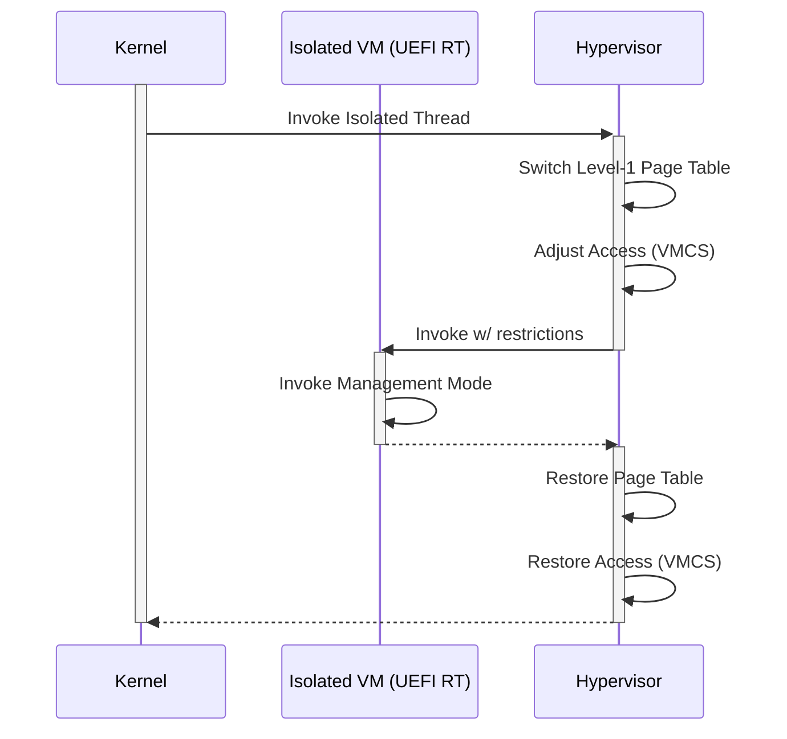
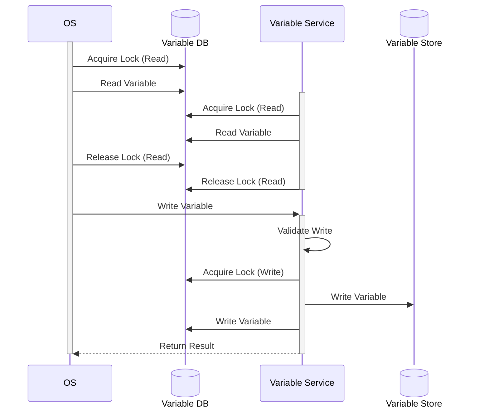
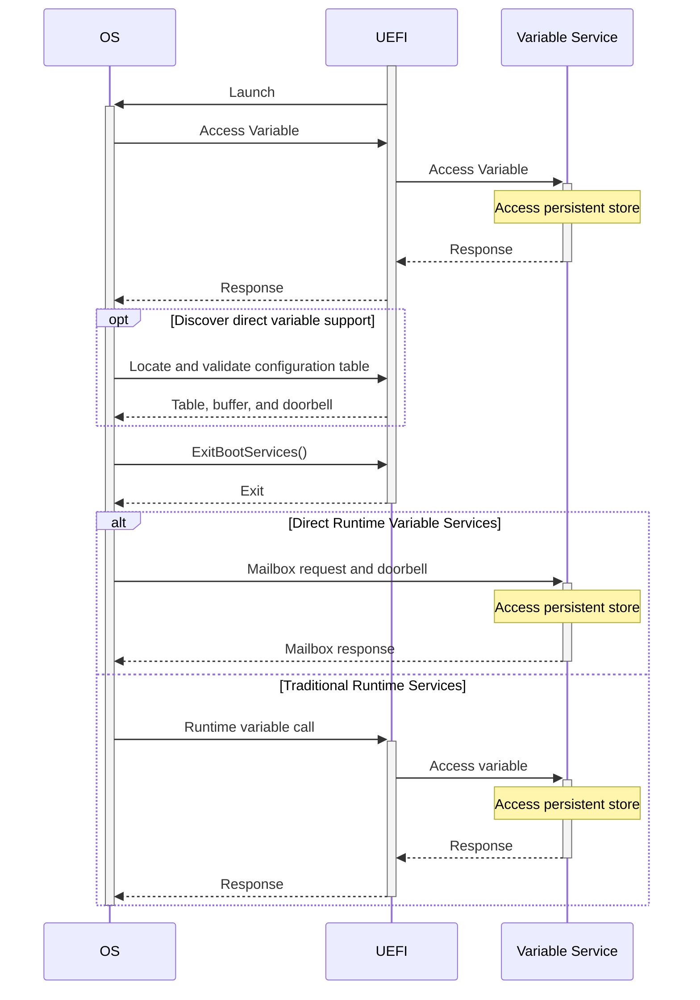
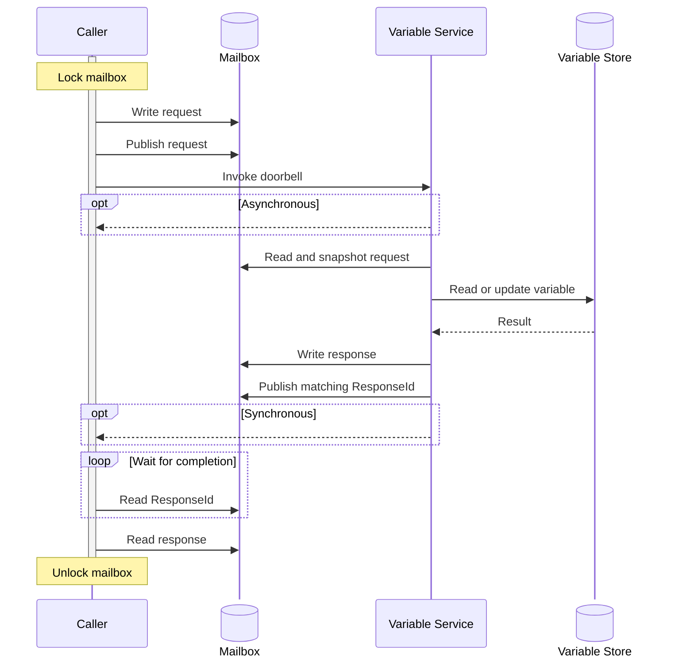
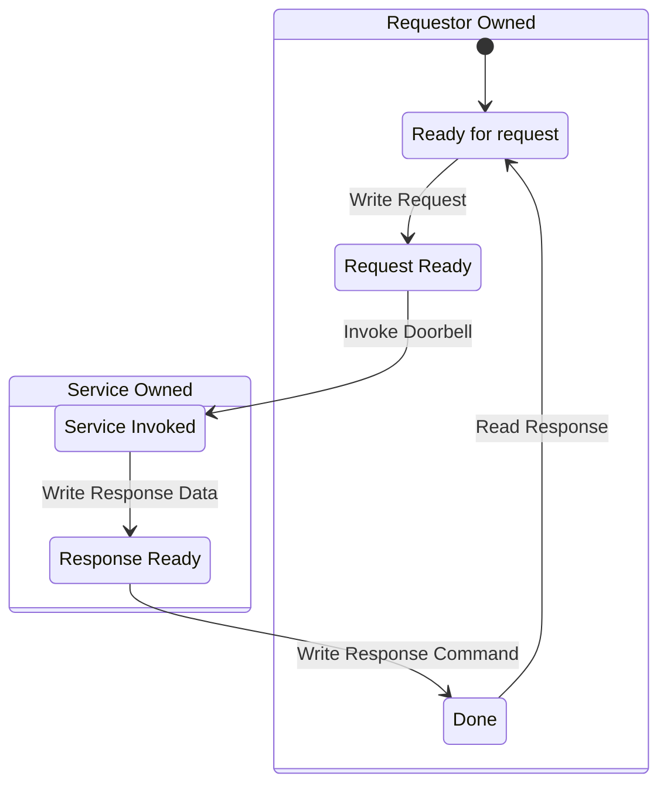

# RFC: Direct Runtime Variable Services

## Metadata

- **RFC Number**: TBD
- **Title**: Direct Runtime Variable Services
- **Status**: Draft
- **Code First Issue**: [tianocore/edk2#13192](https://github.com/tianocore/edk2/issues/13192)

## Change Log

- 2026-09-25: Initial RFC created.

## Motivation

The UEFI runtime services inherited by an operating system are opaque regions
of executable firmware code and mutable data. The operating system cannot
independently authenticate the executable state after mutation, and it cannot
reliably hash the runtime environment because the meaning and location of all
mutable portions are not described. An operating system that requires some
runtime services but implements isolation mechanisms to remove UEFI code from
its Trusted Computing Base (TCB) cannot invoke these runtime services as
intended without compromising its TCB.

This model conflicts with systems that use a Dynamic Root of Trust for
Measurement (DRTM) or another isolation boundary to establish an isolated
operating-system-owned trust domain. Invoking arbitrary inherited
firmware code inside that domain weakens the boundary, even when the firmware
code is only a translation layer for a more isolated implementation.

On typical modern systems, the core implementation of UEFI variable services
does not reside in the runtime code inherited by the operating system and, in fact,
cannot provide features such as authenticated variables. Instead, it runs
in a more privileged or isolated execution environment, such as System Management
Mode (SMM), or a secure partition reached through Firmware Framework for Arm
A-profile (FF-A), or another platform security processor. The UEFI runtime functions
exposed to the operating system largely translate the UEFI interface into the
calling convention used by that environment.

The management mode interface is already converging on the MM Communication
Protocol defined by the Platform Initialization Specification. Requiring the
operating system to execute an opaque translation layer to reach that service
adds attack surface without adding a security boundary.

This RFC proposes a UEFI-defined data interface that allows an enlightened
operating system to invoke the isolated variable service directly. The caller
writes a command to a firmware-described communication buffer, signals a
platform-selected doorbell, and reads the status and response from the same
buffer. No firmware code executes in the operating system context.

The existing UEFI variable runtime services remain available as a compatibility
fallback. The operating system chooses whether to use the direct interface.

## Technology Background

### Runtime Variable Services

UEFI defines four runtime variable services:

- `GetVariable()`
- `GetNextVariableName()`
- `SetVariable()`
- `QueryVariableInfo()`

These services provide access to persistent and volatile platform state,
including authenticated variables, Secure Boot configuration, boot policy, and
platform-specific configuration. Firmware must continue to own access policy,
authentication, and persistent storage even when the operating system no
longer invokes the traditional runtime execution environment.

### Why This RFC Is Limited to Variable Services

Variable services are the primary runtime interface for which operating systems
still require firmware-owned behavior after `ExitBootServices()`. The remaining
runtime services either overlap with architecture or ACPI mechanisms, are used
only during the boot-to-runtime transition, or should not normally be exposed
for arbitrary use at runtime.

#### Time Services

`GetTime()`, `SetTime()`, `GetWakeupTime()`, and `SetWakeupTime()` overlap with
the following ACPI facilities and do not require this mailbox protocol:

- Modern devices may expose the Time and Alarm device (`ACPI000E`), which
  provides a hardware-independent clock and wake-alarm interface.
- Older devices may expose RTC/CMOS devices (`PNP0B00`, `PNP0B01`, or
  `PNP0B02`).

[ACPI 6.6, Section 9.17.14, "Relationship to UEFI time
source"](https://uefi.org/specs/ACPI/6.6/09_ACPI_Defined_Devices_and_Device_Specific_Objects.html#relationship-to-uefi-time-source)
states:

> The Time and Alarm device must be driven from the same time source as UEFI
> time services. This ensures that the platform has a consistent value of real
> time (time of day) and wake alarms. The OSPM can interact with this value
> using either ACPI or UEFI.

The runtime service path is therefore redundant on systems that provide the
ACPI interface.

#### Virtual Memory Services

`SetVirtualAddressMap()` and `ConvertPointer()` transition runtime firmware from
physical to operating system virtual addresses. A virtual address map may only
be applied once and is normally installed immediately after
`ExitBootServices()`. These services are not used during steady-state runtime.
If the operating system does not invoke runtime firmware afterward, there is no
need to virtualize it.

#### Reset System

`ResetSystem()` overlaps with preferred architecture and platform mechanisms.
ACPI systems may use the `RESET_REG` Generic Address Structure and
`RESET_VALUE` in the Fixed ACPI Description Table when `RESET_REG_SUP` is set.
Arm systems commonly use PSCI `SYSTEM_RESET`, `SYSTEM_RESET2`, `SYSTEM_OFF`, or
`SYSTEM_OFF2`.

- [ACPI 6.6, Section 4.8.3.6, "Reset
Register"](https://uefi.org/specs/ACPI/6.6/04_ACPI_Hardware_Specification.html#reset-register)
- [Arm Power State Coordination Interface 1.3, Sections
5.10-5.13](https://support.arm.com/documentation/den0022/fb)

These interfaces provide operating systems with platform-defined reset and
shutdown mechanisms without requiring a new runtime mailbox command.

#### Monotonic Counter

`GetNextHighMonotonicCount()` is not redundant with another standard
interface, but there is no demonstrated modern operating system requirement for
it. The proposed protocol reserves room for future runtime commands if such a
use case arises.

#### Capsule Services

`UpdateCapsule()` and `QueryCapsuleCapabilities()` provide firmware update
staging and reset behavior. Firmware update is valuable, but permitting it at
arbitrary runtime creates additional security concerns, and some platforms
already prohibit capsule submission after `ExitBootServices()`. Capsule
services are therefore outside the scope of this RFC and remain accessible
through the traditional runtime interface where supported and may be used
before `ExitBootServices()`.

While not a direct replacement, Arm has also defined an alternative update
mechanism that better aligns with an isolated security model. See
[Platform Security Firmware Update for the A-profile Arm Architecture](https://support.arm.com/documentation/den0118/latest/).

### Existing EDK II Runtime Variable Cache

EDK II implements a variable runtime cache in
`MdeModulePkg/Universal/Variable/RuntimeDxe`, gated by
`PcdEnableVariableRuntimeCache`. It addresses the same management mode entry
cost that motivates caching in this proposal, but it is a private contract
between the management mode variable driver and the UEFI runtime DXE driver.
It is not an operating-system-visible interface.

The current implementation maintains byte-for-byte replicas of the HOB,
non-volatile, and volatile variable stores. A shared `CACHE_INFO_FLAG`
structure coordinates readers and management mode updates through `ReadLock`,
`PendingUpdate`, and `HobFlushComplete`. Reads are ordinary memory accesses in
the steady state, management mode is entered on the first read after an
out-of-band update, and writes always enter management mode.

## Goals

1. Remove inherited UEFI runtime variable code and data from the operating
   system trusted computing base when both the platform and operating system
   support the direct interface.
2. Preserve the observable behavior of the four UEFI variable services,
   including `EFI_STATUS` values, attributes, enumeration, deletion, and
   size-query behavior.
3. Allow an operating system loader to discover and validate the interface
   before `ExitBootServices()` while keeping the service available afterward.
4. Define an architecture and platform-independent data model with a small,
   discoverable platform-specific doorbell.
5. Preserve firmware security policy, including authenticated variable checks,
   access restrictions, and protection of data from untrusted agents.
6. Define ownership, synchronization, memory ordering, and timeout behavior for
   the shared communication buffer.
7. Support caller-managed caching without standardizing or exposing the
   firmware variable store format.
8. Permit backward-compatible extension through versions, sizes, flags, and
   reserved command ranges.
9. Preserve the existing UEFI runtime variable services as a compatibility
   fallback.
10. Leave the protocol extensible for other runtime services if a demonstrated
    need arises.

### Non-Goals

- Removing or deprecating the existing UEFI runtime services.
- Standardizing an internal firmware variable store format.
- Defining direct access to time, virtual memory, reset, monotonic counter, or
  capsule services.
- Defining the implementation of variable policy or authenticated variables.
- Requiring every platform to use the same management mode transport.

## Requirements

1. An operating system must be able to use variable services after
   `ExitBootServices()` without executing inherited firmware code within its
   trust domain.
2. Adoption must be optional for both the platform and the operating system,
   and an operating system must be able to determine before
   `ExitBootServices()` whether the interface is suitable for use.
3. The direct interface must preserve the externally observable semantics of
   the UEFI variable services so that using it does not change variable-service
   behavior.
4. The interface must not expose or require knowledge of the firmware's
   internal variable-store representation or isolated execution environment.
5. The service must preserve firmware ownership of variable policy,
   authentication, access control, and persistent storage.
6. The interface must remain correct and deterministic across supported
   architectures and platform transports, including under concurrent access,
   delayed completion, and failure.
7. Untrusted or incompatible input must not compromise firmware, disclose
   protected data, or cause unsafe state changes.
8. Optional performance features, including caller-managed caching, must not
   weaken variable coherency or the security properties of the service.
9. The interface must support backward-compatible evolution and allow
   unsupported capabilities to be rejected safely.
10. Platforms and operating systems that do not adopt the direct interface
    must retain the existing UEFI runtime variable services and behavior.

## UEFI/PI Specification Impact

This RFC requires an update to the UEFI Specification. The proposal is tracked
through the EDK II Code First process in
[[Code First] Direct Runtime Variable Services](https://github.com/tianocore/edk2/issues/13192).

The UEFI Specification change is expected to define:

- A configuration table used to discover Direct Runtime Variable Services.

It is also proposed that the UEFI specification adds definitions for the following:

- Definition for the Direct Variable Service data interface.
- Definition for the Direct Variable Service doorbell methods.

However, due to the nature of the proposed interface it may be desirable to split
the definition of the Direct Variable Service protocol into a separate specification
as its hardware-like interface is different from the usual UEFI definitions.

This proposal makes no explicit change to PI specification based definitions,
such as the MM Communication Protocol, but the definition defined here is partially
redundant. For this reason, it attempts to be partially compatible with use for
MM communicate, but no PI change is required or defined here.

## Backward Compatibility

The proposal is additive.

- Platforms that do not install the configuration table behave exactly as they
  do today.
- Operating systems that do not recognize or accept the configuration table
  continue to call traditional UEFI runtime variable services.
- Platforms implementing the direct interface must continue to expose the
  traditional runtime variable services.
- An operating system may reject the direct interface during validation and use
  the traditional interface.
- Table versions, table sizes, feature flags, and reserved command ranges allow
  future compatible extension.

## Platform/Package Impact

The reference implementation is expected to affect the following EDK II areas:

- `MdePkg`: Public GUID, table, command, packet, flag, and attribute definitions.
- `MdeModulePkg/Universal/Variable/RuntimeDxe`: Configuration table publication
  and optional reuse of the direct interface by the compatibility runtime path.
- Management mode variable services: Request validation, command dispatch, and
  response publication.
- Platform packages: Communication buffer allocation, memory attributes,
  doorbell description, and platform-specific transport wiring.
- A reference platform such as OVMF or an Arm virtual platform: End-to-end
  implementation and interoperability testing.

No platform is required to enable this feature.

## Unresolved Questions

Interface:

1. What failure reporting is required when the service becomes permanently
   unavailable after a transaction has been submitted?
2. Are there any potential variable implementations that are incompatible with
   this design?

Caching:

1. What is the practical performance difference between the current
   firmware-maintained full-store cache and the proposed caller-managed
   write-through cache?
2. Must the caching contract support variables created or deleted at runtime by
   management mode agents other than the operating system?
3. Is per-variable non-cacheability sufficient, or is a generation counter or
   full-cache invalidation mechanism also required?

## Prior Art/Related Work

### PI MM Communication Protocol

The PI Specification defines a common mechanism for communicating with
management mode. This proposal follows the same broad request/response model but
defines a constrained UEFI-facing ABI for variable services rather than
exposing a firmware-internal dispatcher to the operating system.

### EDK II Variable Runtime Cache

The existing EDK II runtime cache demonstrates the importance of avoiding a
management mode transition for every variable read. It also demonstrates that
out-of-band updates require an explicit coherency contract. This RFC preserves
the performance objective while avoiding a standardized firmware store layout.

### FF-A Direct Messaging

FF-A provides a standard method for an operating system or hypervisor to invoke
a secure partition on Arm systems. The FF-A doorbell in this RFC uses that
transport while retaining the same architecture-independent mailbox packets.

## Alternatives

### Alternative 1: Sandbox Traditional Runtime Services

One alternative is for the operating system to execute inherited runtime
services in an isolated address space or virtual machine with a restricted
second-level translation context. The runtime code would be allowed to access
only the UEFI runtime regions and hardware resources required for compatibility.



**Benefits**:

- Requires no platform firmware changes and can be deployed on existing
  systems.
- The isolation mechanism could be reused for other untrusted kernel-mode code.

**Limitations**:

- Adds substantial operating system and transition overhead to execute what is
  commonly only a translation layer into a firmware enclave.
- Requires the operating system to maintain an additional isolated execution
  context.
- Creates compatibility risk because runtime firmware may depend on processor
  state or hardware access that is not described by UEFI memory maps.
- Leaves a larger attack surface than a validated data protocol because policy
  for resource access, such as MSRs, may not scale securely.
- Without standardization, good SMI/SMC invocations may not be discernable from
  malicious.

This approach remains useful for existing systems, but it does not provide the
small, explicit trust boundary desired for new platforms.

### Alternative 2: Shared Database

Firmware could publish the variable store, or a policy-filtered projection of
it, as a shared memory structure that the operating system reads directly.



**Benefits**:

- Eliminates the per-read transaction.
- Makes enumeration inexpensive.
- Allows reads to become ordinary memory accesses.

**Limitations**:

- Requires standardizing a durable in-memory database format, which is a much
  larger and more brittle specification surface than request packets.
- Constrains firmware internal storage layout or requires firmware to maintain
  and synchronize a second projection.
- Writes still require a transactional path.
- Creates contention and potential race conditions between OS and service.
- Requires cache coherency and atomics between OS and service environment for
  performant operations.

The proposed caller-managed cache obtains most of the steady-state read benefit
without exposing the firmware store format.

### Alternative 3: Expose the MM Communication Buffer

The operating system could use the PI MM Communication Protocol and the
implementation-specific variable communication packets directly.

**Benefits**:

- Reuses an existing firmware communication mechanism.
- May require less initial firmware implementation work.

**Limitations**:

- The PI interface is a firmware component interface rather than a stable
  operating system ABI.
- It may expose unrelated management mode handlers and a larger parser and
  dispatch surface.
- Existing packet formats and handler identifiers are implementation details
  and may vary between firmware implementations.
- It couples the operating system to the firmware's internal architecture.
- Not written to work with device-based services such as from a coprocessor.

## Implementation Design

The chosen design uses standard packet-based transactions with defined rules,
currently using a firmware-described shared memory communication buffer
(mailbox) paired with a discoverable notification method (doorbell). The operating
system writes a request, signals the doorbell, and waits for the service to
publish a matching response. No firmware code executes in the operating system
context.

### Architecture Overview

The operating system loader discovers support before `ExitBootServices()` by
locating a UEFI configuration table. It validates the table, communication
buffer, selected doorbell, sizes, versions, and memory attributes. If validation
succeeds, the operating system may use the direct interface after
`ExitBootServices()`. Otherwise, it uses the traditional runtime services. The
loader must always use traditional runtime services prior to `ExitBootServices()`.
After `ExitBootServices()` the OS must exclusively use the Direct Variable mechanism
or traditional runtime services. After invoking one, the other may not be used
during that boot cycle.



The following diagram further demonstrates the interaction between the OS and the
variable service using the discovered mailbox and doorbell method. The selected
doorbell may be synchronous or asynchronous so completion is always defined by the
response state in the communication buffer. The variable service operates only
on request, and will not access the mailbox unless processing a request.



### Configuration Table

The operating system loader discovers support by locating the Direct Runtime
Variable Services configuration table.

```c
// {e7df99cc-72d7-40a5-94cb-9e99b4a445b0}
#define EFI_DIRECT_VARIABLE_TABLE_GUID \
  { 0xe7df99cc, 0x72d7, 0x40a5, \
    { 0x94, 0xcb, 0x9e, 0x99, 0xb4, 0xa4, 0x45, 0xb0 } }

#define EFI_DIRECT_VARIABLE_TABLE_VERSION  1

typedef struct {
  UINT32    Version;
  UINT32    Size;
  UINT32    Doorbell;
  UINT32    Flags;
  UINT64    CommunicationBufferAddress;
  UINT64    CommunicationBufferSize;
  UINT32    DoorbellDataOffset;
  UINT32    DoorbellDataSize;
} EFI_DIRECT_VARIABLE_TABLE;

// Doorbell methods
#define EFI_DIRECT_VAR_DOORBELL_REGISTER  0x00000000
#define EFI_DIRECT_VAR_DOORBELL_IO        0x00000001
#define EFI_DIRECT_VAR_DOORBELL_FFA       0x00000002

// Flag definitions
#define EFI_DIRECT_VAR_FLAG_MMIO          0x00000001
#define EFI_DIRECT_VAR_FLAG_VAR_CACHING   0x00000002
```

`Version` identifies the table version. New versions must remain compatible
with fields defined by earlier versions.

`Size` is the size of the complete table in bytes, including any doorbell data
appended to it. A caller must reject a table too small for the fields required
by its version.

`Doorbell` selects the doorbell description.

`Flags` describes optional behavior and communication buffer properties.

- `EFI_DIRECT_VAR_FLAG_MMIO` indicates that the buffer is backed by MMIO. The
  caller must access it using uncached or device memory semantics.
- `EFI_DIRECT_VAR_FLAG_VAR_CACHING` indicates that the platform provides the
  cacheability guarantees defined below.

`CommunicationBufferAddress` is the physical address of the communication
buffer. If a future transport does not support the mailbox, then this field will
be `NULL` and any relevant addresses will be provided via the transport data.

`CommunicationBufferSize` is the size of the communication buffer in bytes. It
must be page aligned and large enough for the platform's maximum supported
variable transaction plus the communication header. If a future transport does
not support the mailbox, then this field will be `0`.

`DoorbellDataOffset` is the byte offset from the beginning of the configuration
table to the selected doorbell data. It is zero when the doorbell requires no
additional data.

`DoorbellDataSize` is the size of the selected doorbell data. It must be zero
when `DoorbellDataOffset` is zero.

The caller must validate all additions and ranges without integer overflow and
must ensure that the doorbell data lies within `Size`.

### Doorbell Methods

The mailbox ABI is independent of the mechanism that notifies the service. A
platform publishes one doorbell description. Future doorbells may be added by
assigning new `Doorbell` values and defining corresponding data structures.

#### Register Doorbell

```c
typedef struct {
  UINT64    RegisterAddress;
  UINT64    RegisterCommand;
  UINT8     RegisterWidth;
} EFI_DIRECT_VARIABLE_DOORBELL_REGISTER;
```

The caller writes `RegisterCommand` to `RegisterAddress` using `RegisterWidth`,
which must be 1, 2, 4, or 8 bytes. The specification must also define byte order
and the memory attributes used to access the register.

#### I/O Doorbell

```c
typedef struct {
  UINT16    Port;
  UINT8     Value;
} EFI_DIRECT_VARIABLE_DOORBELL_IO;
```

The caller writes `Value` to the specified I/O port. The write may generate an
SMI or notify another platform subsystem that a command is ready.

#### FF-A Doorbell

```c
typedef struct {
  UINT16    Endpoint;
} EFI_DIRECT_VARIABLE_DOORBELL_FFA;
```

The caller invokes `FFA_MSG_SEND_DIRECT_REQ2` for `Endpoint` using service UUID
`B31A497B-3854-4FBF-92EC-4121FDDB2653`. Registers `x4` through `x17` are
reserved and must be zero.

The caller must correctly handle `FFA_INTERRUPT` and `FFA_YIELD` responses in
addition to Direct Runtime Variable Services status responses. Failure to
complete the FF-A protocol can leave the variable service inaccessible.

### Communication Buffer

The communication buffer is retained after `ExitBootServices()` and must be
large enough to complete any supported variable transaction in one operation.
The service and caller must validate every offset and size against the
advertised buffer size before accessing the payload.

```c
#define EFI_DIRECT_VARIABLE_HEADER_VERSION  1

typedef struct {
  UINT32    Command;
  UINT32    Reserved;
} EFI_DIRECT_VARIABLE_HEADER;

typedef struct {
  EFI_DIRECT_VARIABLE_HEADER  Header;
  UINT32                      RequestSize;
  UINT32                      DataOffset;
} EFI_DIRECT_VARIABLE_REQUEST_HEADER;

typedef struct {
  EFI_DIRECT_VARIABLE_HEADER  Header;
  UINT32                      RequestSize;
  UINT32                      DataOffset;
  EFI_STATUS                  ResponseStatus;
} EFI_DIRECT_VARIABLE_RESPONSE_HEADER;
```

`EFI_DIRECT_VARIABLE_HEADER` is common between the command and response, serving
both the request information as well as the response status for asynchronous
variable service processing. The requestor will fill this header as well as
the request specific data before calling the doorbell. After invoking the doorbell
the requestor must wait for the `Command` field to be set to
`EFI_DIRECT_VAR_COMMAND_RESPONSE` before processing the response or accessing
any other data beyond the header.

`DataOffset` both for the request and response is the 64-bit aligned byte offset
from the beginning of the communication buffer to the payload region. The same
region is used for the request and response. Header access must not overlap the
payload region.

The request and response reserved fields must be written as zero and ignored by
receivers unless a future version assigns meaning to them.

```c
#define EFI_DIRECT_VAR_COMMAND_NONE                 0x00000000
#define EFI_DIRECT_VAR_COMMAND_GET_VARIABLE         0x00000001
#define EFI_DIRECT_VAR_COMMAND_GET_VARIABLE_NAMES   0x00000002
#define EFI_DIRECT_VAR_COMMAND_SET_VARIABLE         0x00000003
#define EFI_DIRECT_VAR_COMMAND_QUERY_VARIABLE_INFO  0x00000004
#define EFI_DIRECT_VAR_COMMAND_GET_ALL_VARIABLES    0x00000005
#define EFI_DIRECT_VAR_COMMAND_RESPONSE             0x00010000

#define EFI_DIRECT_VAR_COMMAND_PLATFORM             0x80000000
```

Commands from `0x00000000` through `0x7fffffff` are reserved for the UEFI
Specification. Undefined values in that range must not be used and must be
rejected by the service.

Commands from `0x80000000` through `0xffffffff` are reserved for platform use.
They must be rejected after `ExitBootServices()` so the operating system-facing
interface cannot expose an undocumented platform command surface at runtime.

### Synchronization and Ownership

The caller is responsible for ensuring that only one transaction is outstanding
at a time. It must serialize all users of the interface, acquire its lock before
accessing the communication buffer, and hold the lock until the response has
been sent.

For each transaction, the caller writes the complete request, then performs any
platform-required cache maintenance before invoking the doorbell. Invoking the
doorbell transfers ownership of the communication buffer to the service.

While the service owns the buffer, the caller must not read or modify any part
of it except to read `Command` while waiting for completion.

The service acquires and copies the complete request before processing it to avoid
any time-of-check to time-of-use (TOCTOU) vulnerabilities. After completing the
transaction, the service must write all data and ensure they are visible to the
caller, including any required cache maintenance, before setting `Command` to
`EFI_DIRECT_VAR_COMMAND_RESPONSE`. At this point, if the mailbox is synchronous
it will return. After writing the response command, the ownership of the buffer
transfers back to the requestor and must not be accessed by the service until the
next doorbell invocation.

The following state machine summarizes communication buffer ownership over a
transaction:



### Timeout Behavior

The caller determines how long it waits actively for a transaction. Expiration
of that timeout does not cancel the transaction and does not transfer ownership
of the communication buffer back to the caller.

After a timeout, the communication buffer remains owned by the service until
the caller observes `Command` equal to `EFI_DIRECT_VAR_COMMAND_RESPONSE`. Until
then, the caller must not:

- Modify the communication buffer.
- Read the request or response payload.
- Invoke the doorbell for another request.
- Reuse the interface.
- Retry the operation through traditional UEFI runtime services.

The caller may continue reading `Command` to detect late completion, where
ownership returns to the caller.

A timed-out write has an indeterminate result until a matching response is
observed. Recovery without observing that response is permitted only after a
system reset or through a recovery mechanism explicitly defined by the selected
doorbell.

### Command Packets

All packet sizes include any variable-length trailing data. Strings are
null-terminated `CHAR16` strings and must be fully contained within the request
or response size. Unless otherwise specified, padding bytes are reserved and
must be zero when written.

#### Get Variable

Request:

```c
typedef struct {
  EFI_GUID    VendorGuid;
  CHAR16      VariableName[];
} EFI_DIRECT_VAR_GET_VARIABLE;
```

Response:

```c
typedef struct {
  UINT32    DataSize;
  UINT32    Attributes;
  UINT8     Data[];
} EFI_DIRECT_VAR_GET_VARIABLE_RESPONSE;
```

The command mirrors [`GetVariable()`](https://uefi.org/specs/UEFI/2.11/08_Services_Runtime_Services.html#getvariable),
but does not implement the size querying behavior as the communication buffer
is guaranteed to be large enough for the max variable size.

#### Get Variable Names

Request:

```c
typedef struct {
  EFI_GUID    VendorGuid;
  CHAR16      VariableName[];
} EFI_DIRECT_VAR_GET_VARIABLE_NAMES;
```

An empty name starts enumeration. Otherwise, the GUID and name identify the
last variable observed by the caller, preserving the enumeration behavior of
[`GetNextVariableName()`](https://uefi.org/specs/UEFI/2.11/08_Services_Runtime_Services.html#getnextvariablename).

Response:

The response for the direct variable will provide as many of the next variables
possible within the size of the communication buffer to minimize the number of
service invocations necessary.

```c
#define EFI_DIRECT_VAR_NAMES_FLAG_COMPLETED  0x00000001

typedef struct {
  UINT32    NumberOfEntries;
  UINT32    Flags;
} EFI_DIRECT_VAR_GET_VARIABLE_NAMES_RESPONSE;

typedef struct {
  EFI_GUID    VendorGuid;
  UINT32      Length;
  CHAR16      VariableName[];
} EFI_DIRECT_VAR_NAME_ENTRY;
```

`Length` is the total byte length of the entry, aligned up to 8 bytes. The
next entry begins at the indicated offset. The service sets
`EFI_DIRECT_VAR_NAMES_FLAG_COMPLETED` when no additional variables remain.

#### Set Variable

Request:

```c
typedef struct {
  UINT32      DataSize;
  UINT32      DataOffset;
  UINT32      Attributes;
  UINT32      Reserved;
  EFI_GUID    VendorGuid;
  CHAR16      VariableName[];
} EFI_DIRECT_VAR_SET_VARIABLE;
```

`DataOffset` is the 8-byte aligned offset from the start of the packet to the variable
data. The variable name and data must both lie fully within `RequestSize` and
must not overlap in a way that changes their interpretation. The service applies
the same creation, replacement, append, deletion, policy, and authentication
rules as
[`SetVariable()`](https://uefi.org/specs/UEFI/2.11/08_Services_Runtime_Services.html#setvariable).

Response:

On success, the entirety of the response data will be the contents of the written
variable. This should be identical to the provided data in all cases except
appends to an authenticated variable. Due to the offsets involved, the
implementor can simply update the data offset to point to the caller's original
data in every other case.

#### Query Variable Info

Request:

```c
typedef struct {
  UINT32    Attributes;
} EFI_DIRECT_VAR_QUERY_VARIABLE_INFO;
```

Response:

```c
typedef struct {
  UINT64    MaximumVariableStorageSize;
  UINT64    RemainingVariableStorageSize;
  UINT64    MaximumVariableSize;
} EFI_DIRECT_VAR_QUERY_VARIABLE_INFO_RESPONSE;
```

The result must match
[`QueryVariableInfo()`](https://uefi.org/specs/UEFI/2.11/08_Services_Runtime_Services.html#queryvariableinfo)
for the same attribute combination.

#### Get All Variables

This bulk command reduces management mode transitions when initially populating
a caller cache.

Request:

```c
typedef struct {
  EFI_GUID    VendorGuid;
  CHAR16      VariableName[];
} EFI_DIRECT_VAR_GET_ALL_VARIABLES;
```

Response:

```c
#define EFI_DIRECT_VAR_ALL_FLAG_COMPLETED  0x00000001

typedef struct {
  UINT32    NumberOfEntries;
  UINT32    Flags;
} EFI_DIRECT_VAR_GET_ALL_VARIABLES_RESPONSE;

typedef struct {
  EFI_GUID    VendorGuid;
  UINT32      EntryLength;
  UINT32      DataSize;
  UINT32      Attributes;
  UINT32      DataOffset;
  CHAR16      VariableName[];
} EFI_DIRECT_VAR_ENTRY;
```

`EntryLength` is the aligned total byte length of the entry. `DataOffset` is the
byte offset from the beginning of the entry to its variable data. The name,
data, and next entry must all lie fully within `ResponseSize`.

The service may return a partial list when all remaining entries do not fit. The
caller resumes using the GUID and name of the final returned entry. The service
sets `EFI_DIRECT_VAR_ALL_FLAG_COMPLETED` when no additional variables remain.

#### Packet Extension

The current definition of direct variables uses a mailbox and doorbell method,
but future instances may use transports that do not support the required memory
or MMIO access. Such future transports, such as MMBI or I3C, may be defined to
use the direct method but with an appropriate transport data in the table to
define their communication method.

### Variable Caching

Entering management mode for every variable read can cause a significant
performance regression, particularly on systems where the doorbell generates
an SMI. The proposed mechanism allows the caller to maintain a write-through
cache of observable variable state.

Firmware does not publish a mirror of its variable store. It returns only the
packets already defined by this RFC, and the caller populates a cache in its own
format. This avoids standardizing a durable in-memory database, requiring
firmware to synchronize a second projection, or placing the complete variable
store in caller-accessible memory.

Because the caller is the only runtime writer of cacheable variables, it can
update its cache following its own successful writes without a separate
invalidation signal.

#### Cacheability Attribute

The following variable attribute is proposed for [UEFI Specification section
8.2](https://uefi.org/specs/UEFI/2.11/08_Services_Runtime_Services.html#variable-services):

```c
#define EFI_VARIABLE_NOT_CACHEABLE  0x00000100
```

A variable stored with `EFI_VARIABLE_NOT_CACHEABLE` may be changed outside the
operating system execution context, so a future read may differ even though the
operating system observed no write. Platforms must apply this attribute to any
variable that may be modified by management mode, a secure partition, another
processor, or another environment with access to the variable store.

The attribute belongs to the platform and describes a property of the variable.
It is not a caching request from the caller.

- The attribute is reported by both `GetVariable()` and direct get commands so
  callers observe the same property through either interface.
- The attribute affects caching only. The variable is otherwise read and
  written normally.
- Only platform code should create a variable with the `EFI_VARIABLE_NOT_CACHEABLE`
  attribute.

#### Platform Guarantees

A platform that sets `EFI_DIRECT_VAR_FLAG_VAR_CACHING` guarantees all of the
following while the direct interface remains in use:

1. A variable not marked `EFI_VARIABLE_NOT_CACHEABLE` will not be altered by
   another runtime environment.
2. A cacheable variable will not be created, altered, or deleted except by the
   caller.

A platform that cannot make every guarantee must leave the flag clear.

#### Caller Behavior

The caller may maintain a cache keyed by vendor GUID and variable name, holding
the attributes and data most recently observed. The cache is an optimization and
discarding it must not affect correctness.

A caching caller must:

- Never cache a variable whose attributes include `EFI_VARIABLE_NOT_CACHEABLE`.
- Invalidate the entry after a failed `SET_VARIABLE` rather than assume the
  store is unchanged.
- Never cache `QUERY_VARIABLE_INFO` results because storage figures may change
  due to firmware bookkeeping such as reclaim.
- Invalidate affected namespace and enumeration entries when it creates or
  deletes a variable.

A caching caller may:

- Update a cached entry after a successful `SET_VARIABLE` to a variable without
  the `EFI_VARIABLE_NOT_CACHEABLE` attribute.

When writing authenticated variables, the caller should only cache the value
of the variable returned by the `SET_VARIABLE` call as the contents of certain
operations like `EFI_VARIABLE_TIME_BASED_AUTHENTICATED_WRITE_ACCESS` and
`EFI_VARIABLE_ENHANCED_AUTHENTICATED_ACCESS` are not predictable to the caller.

The cache may contain security state such as `SecureBoot`, `db`, and `dbx`. It
must receive the same integrity protection as other security-critical operating
system state. Serving stale or attacker-modified cached security state is
equivalent to the firmware service returning that state and would defeat the
security objective of this proposal.

### Validation Rules

Both caller and service must treat the other side as untrusted and validate all
shared data before use.

At minimum, validation includes:

- Supported table and header versions.
- Minimum and maximum structure sizes.
- Integer overflow in every offset-plus-size calculation.
- Alignment requirements.
- Containment of table data within `Size`.
- Containment of request and response payloads within the communication buffer.
- Null termination and bounds of every variable name.
- Entry lengths and forward progress for list responses.
- Command-specific minimum sizes.
- Reserved fields and unsupported flags.
- Supported variable attribute combinations.
- Doorbell-specific address, width, endpoint, and memory type constraints.

The service must snapshot the validated request before acting on it so that a
malicious or malfunctioning caller cannot change fields during processing.

## Testing Strategy

### Unit Tests

- Validate every fixed and variable-length request packet at its minimum and
  maximum legal size.
- Reject truncated headers, unterminated names, overlapping fields, invalid
  offsets, integer overflow, unsupported commands, and nonzero reserved fields.
- Verify buffer ownership transitions.
- Verify get, set, append, delete, enumerate, size-query, and query-info status
  behavior against the existing UEFI variable service implementation.
- Verify cache update and invalidation rules for ordinary, append, and
  authenticated writes.

### Integration Tests

- Implement one complete reference path on an emulated platform.
- Discover and validate the table before `ExitBootServices()`.
- Exercise every command after `ExitBootServices()` without invoking inherited
  runtime variable code.
- Compare direct and traditional service results for the same variable store.
- Verify Secure Boot and authenticated variable policy is unchanged.
- Verify fallback when the table is absent, malformed, uses an unsupported
  version, or advertises an unsupported doorbell.

### Concurrency and Failure Tests

- Attempt concurrent callers and verify caller serialization.
- Exercise a doorbell that completes before return and one that completes
  afterward.
- Delay completion beyond the caller timeout and verify that the buffer is not
  reused or the operation retried.
- Complete a timed-out transaction late and verify that the response remains
  authoritative.
- Inject malformed responses and verify the caller fails safely.

### Security Tests

- Fuzz all table, header, command, offset, size, and list-entry fields on both
  sides of the boundary.
- Verify that platform-reserved commands are rejected after
  `ExitBootServices()`.
- Verify that the service applies existing variable policy and authenticated
  variable checks to direct requests.
- Verify communication buffer memory protections before and after
  `ExitBootServices()`.
- Verify that untrusted agents cannot alter the caller cache or communication
  buffer without detection by the owning trust domain.

### Performance Tests

- Measure direct uncached reads and writes against traditional runtime services.
- Measure cold-cache population through individual get commands and
  `GET_ALL_VARIABLES`.
- Measure steady-state cached reads.
- Measure boot and runtime memory overhead.
- Compare caller-managed caching with `PcdEnableVariableRuntimeCache` on the
  same platform.

## Migration/Adoption Plan

1. **Specification and prototype**: Develop the UEFI draft and EDK II reference
   implementation openly through Code First issue 13192 and its draft pull
   request.
2. **Reference platform**: Enable one emulated platform and publish validation
   tests that compare the direct and traditional interfaces.
3. **UEFI standardization**: Submit the reviewed specification text to the UEFI
   Forum as an ECR. Keep implementation pull requests in draft until the
   dependent specification changes are approved and publicly available.
4. **Operating system adoption**: Add opt-in discovery, validation, direct
   variable access, and fallback to an operating system implementation.
5. **Platform adoption**: Add doorbell and management mode backends on physical
   platforms. Adoption remains optional and does not remove traditional runtime
   services.
6. **Caching evaluation**: Enable caller caching only on platforms that can make
   all required guarantees. Use performance results to determine whether
   additional invalidation mechanisms are needed.

The existing runtime services are not scheduled for deprecation by this RFC.

## Guide-Level Explanation

### For Operating System Developers

During boot, locate and validate the Direct Runtime Variable Services
configuration table. If the table, communication buffer, and doorbell are
supported, retain the required mappings and serialize all access to the
mailbox. After `ExitBootServices()`, submit variable commands through the
mailbox and use matching request and response identifiers to determine
completion. If discovery or validation fails, continue using traditional UEFI
runtime variable services.

Caching is optional. Only cache variables when the platform advertises the
caching flag, and never cache a variable marked `EFI_VARIABLE_NOT_CACHEABLE`.

### For Firmware Developers

Allocate a communication buffer that remains available after
`ExitBootServices()`, install the configuration table, and describe a doorbell
that reaches the isolated variable service. The service must validate and
snapshot requests, apply the existing variable policy, and publish responses
using the ownership and memory ordering rules in this RFC.

Continue installing traditional UEFI runtime variable services. The direct
interface is an additional path, not a replacement required for compatibility.

Advertise caller caching only if no other runtime agent can modify, create, or
delete cacheable variables without the operating system observing the change.

### For Platform Developers

Choose a doorbell appropriate for the platform security architecture and ensure
that its register, I/O port, or endpoint remains available at runtime. Protect
the communication buffer from unrelated agents while allowing the caller and
variable service to access it with coherent memory semantics.

The platform integration must define memory attributes, cache maintenance, and
recovery behavior for the selected doorbell. It must also identify every
variable that can be changed out of band by applying
`EFI_VARIABLE_NOT_CACHEABLE`.
