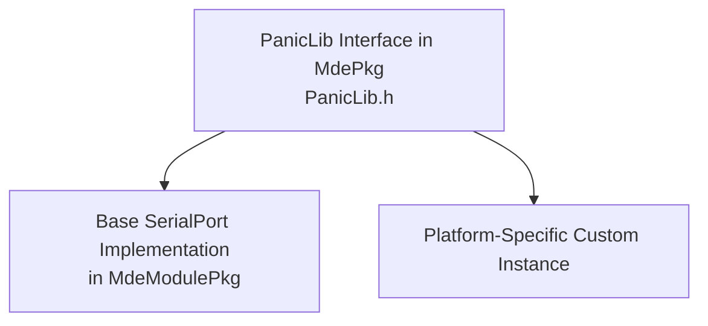

# RFC: Introduction of a Panic Library for EDK2

## Metadata

- **RFC Number**: 000
- **Title**: Introduction of a Panic Library for EDK2
- **Status**: Draft

## Change Log

- 2026-07-22: Initial RFC created

## Motivation

EDK2 firmware modules currently handle catastrophic early-boot failures inconsistently.

1. Inconsistent reporting:
   - Inconsistent use of ASSERT, DEBUG macros, custom halt logic, and message formatting.
   - ASSERT and DEBUG macros may be disabled by platform configuration.
   - No clear correlation between error description and source location.
2. Limited diagnostics:
   - Generic error messages without clear source file and line.
   - No standardized format for catastrophic failure output.
   - Root cause is difficult to identify from console output alone.
3. Early-boot constraints:
   - Early boot failures require simple, reliable reporting before most services are available.
   - Complex frameworks are not suitable early in boot.
   - A lightweight mechanism with minimal dependencies is needed.

## Technology Background

- EDK2 code runs across multiple boot phases (SEC/PEI/DXE/MM), and each phase exposes a
different set of services and debug facilities.
- EDK2 commonly introduces cross-cutting functionality through library classes, allowing
packages and platforms to select phase-appropriate implementations in DSC files.
- This proposal follows that model by defining PanicLib as a small library-class interface
 with pluggable implementations, allowing minimal early-boot instances or optional platform-specific overrides.

## Goals

1. Provide a consistent interface for reporting unrecoverable firmware failures.
2. Standardize panic diagnostics with filename and line number.
3. Keep implementation lightweight enough for SEC/PEI use.
4. Only target catastrophic failures, leaving recoverable error handling as is.

## Requirements

1. Provide a public library class interface in MdePkg.
2. Provide at least a base implementation that prints panic over serial and halts.
3. Avoid dynamic allocation and complex dependencies.
4. Allow platform owners to provide custom PanicLib instances for complex error handing.

## UEFI/PI Specification Impact

- This RFC does not require UEFI or PI specification changes.
- The behavior is implementation guidance for catastrophic internal firmware failures.
- The proposal is orthogonal to specification-defined protocol behavior.
- No specification extensions are required.

## Backward Compatibility

- Breaking changes: Will require a new library instance once drivers start consuming PanicLib.
- Migration path: Incremental adoption by replacing selected catastrophic dead-loop patterns with panic calls.
- Deprecation: No immediate deprecation required; legacy fatal handling can coexist during migration.
- Compatibility layer: A NULL library instance can preserve opt-out behavior where needed.

## Platform/Package Impact

- **MdePkg**: New library class header and declaration.
- **MdeModulePkg**: Base implementation using SerialPort output and dead loop.
- **Platforms**: Optional custom implementations and DSC/FDF integration updates.
- **Build tooling**: No tooling changes.

## Unresolved Questions

1. What exclusion policy should we apply for modules that should not adopt PanicLib during
[Phase 2 of the Migration/Adoption Plan](#migrationadoption-plan)?
    - For example: late DXE drivers with recoverable error paths, optional feature drivers, and modules where failure
    can be reported to caller.

2. What normative classification test should reviewers use to decide PANIC() vs regular error handling?
    - Candidate rule: use PANIC only when execution cannot safely continue and no valid recovery or escalation path
    exists.

3. Which concrete decision criteria must all PANIC call sites satisfy?
    - Suggested criteria: (a) invariant violation affecting core boot assumptions, (b) required critical resource/state
    is unavailable, (c) continuing risks undefined or insecure state.

4. Should this RFC define a mandatory review checklist for new PANIC call sites?
    - Example checklist: why recovery is impossible, what invariant failed, whether sensitive data is excluded from the
    message, and whether a regular EFI_STATUS path was considered.

5. How should existing ASSERT + CpuDeadLoop patterns be classified during migration?
    - Should each call site be tagged as "convert to PANIC", "keep as ASSERT", or "convert to status-return" based on
    the classification rules above?

## Prior Art/Related Work

- [mu_basecore PanicLib Implementation](https://github.com/microsoft/mu_basecore/blob/release/202511/MdePkg/Include/Library/PanicLib.h)
- [EDK2 Library Classes Documentation](https://github.com/tianocore/edk2/blob/master/Readme.rst)
- [UEFI Platform Initialization Specification](https://uefi.org/sites/default/files/resources/UEFI%20PI%201.8%20Errata%20A.pdf)
- Existing EDK2 patterns using ASSERT/DEBUG plus `CpuDeadLoop()` in catastrophic paths.

## Alternatives

### Alternative 1: Continue using ASSERT/DEBUG plus local dead-loop logic

- **Pros**: No new library class required.
- **Cons**: Inconsistent behavior, weak diagnostics, and possible compile-time disablement of key output.
- **Why not chosen**: Does not standardize fatal reporting and does not improve triage quality.

### Alternative 2: Introduce a richer panic framework with callbacks/policies

- **Pros**: More flexibility and possible extensibility.
- **Cons**: Higher complexity, more dependencies, and poor fit for SEC/PEI constraints.
- **Why not chosen**: Early boot needs a minimal, robust primitive.

### Alternative 3: Implement PANIC into DebugLib

- **Pros**: Compatibility with existing projects
- **Cons**:
  - Custom panic functionality requires entire DebugLib replacement.
  - Tightly couples output method (i.e. SerialLib) into DebugLib
  - Platforms sometimes use NULL DebugLib in release builds
- **Why not chosen**:
  - PanicLib needs to work independent of platform DebugLib choices

### Alternative 4: Route panics through a CPU exception handler

- **Pros**:
  - Centralized fatal path can capture architecture-specific context (for example, exception vector, fault address, and
    CPU registers).
  - Can improve post-mortem analysis when failure is already an exception-triggering condition.
  - May align with existing platform exception-reporting flows.
- **Cons**:
  - Exception handlers would need to be identified and implemented to handle PANIC paths, and that architecture-specific
    work would require additional development time.
  - Exception infrastructure availability and fidelity vary by phase and architecture (SEC/PEI/DXE/MM).
  - Higher implementation complexity and risk around nesting/re-entrancy if panic occurs during exception handling.
- **Why not chosen**:
  - PanicLib should be implemented first as the explicit, deterministic baseline for unrecoverable logic failures.
  - Exception-handler integration can be implemented later as a complementary enhancement after PanicLib adoption.

## Implementation Design

This RFC introduces a simple PanicLib interface plus a macro convenience wrapper.

### Architecture Overview



### Detailed Design

#### Core API

Function declaration:

```c
VOID
EFIAPI
PanicReport (
IN CONST CHAR8  *FileName,
IN UINTN        LineNumber,
IN CONST CHAR8  *Description
);
```

Convenience macro:

```c
#define PANIC(Message) \
    do { \
    _PANIC(Message); \
    ANALYZER_UNREACHABLE(); \
    } while (FALSE)
```

#### Output Format

Panic messages use this standardized format:

```text
PANIC <FileName>(<LineNumber>): <Description>
```

Example catastrophic outputs:

```text
PANIC UefiCpuPkg/PiSmmCpuDxeSmm/PiSmmCpuCommon.c(566): Incorrect number of processors!
PANIC UefiCpuPkg/PiSmmCpuDxeSmm/PiSmmCpuCommon.c(1040): TileSize larger than 8KB
PANIC MdeModulePkg/Universal/ResetSystemPei/ResetSystem.c(306): Failed to build or get the RecursionDepthPointer Hob
```

#### Usage Boundary

PanicLib is only for catastrophic, unrecoverable firmware failures. Recoverable conditions should continue to use normal
EFI status/error-handling paths.

#### Implementation Strategy

1. **Phase 1 (MdePkg)**: Add `MdePkg/Include/Library/PanicLib.h` and `MdePkg/Library/PanicLibNull/`.
2. **Phase 2 (MdeModulePkg)**: Add `MdeModulePkg/Library/BasePanicLib/` (SerialPort implementation).
3. **Phase 3 (Platform Adoption)**: Platforms select base instance or provide custom instance.

#### Key Characteristics

- Simplicity: single interface and minimal configuration.
- Reliability: suitable for early boot with minimal infrastructure.
- Debuggability: standardized human-readable output with source location.
- Reproducibility support: overridable line-number macro.
- Minimal dependencies: no dynamic memory required.

#### Recommended Error Message Style

- Use direct language that identifies the failed invariant or required dependency.
- Keep messages short and actionable.
- Avoid generic phrases such as "unexpected error".
- Do not include secrets or sensitive runtime values.

### Code Examples

Example 1: Processor validation

```c
#include <Library/PanicLib.h>

VOID
ValidateProcessorCount (
  IN UINTN  NumberOfProcessors,
  IN UINTN  MaxNumberOfCpus
)
{
  if (NumberOfProcessors != MaxNumberOfCpus) {
    PANIC("Incorrect number of processors!");
  }
}
```

Example 2: Critical HOB retrieval

```c
#include <Library/PanicLib.h>
#include <Library/HobLib.h>

VOID
InitializeResetDepth (
  VOID
)
{
  EFI_HOB_GUID_TYPE  *Hob;

  Hob = GetFirstGuidHob(&mResetDepthGuid);
  if (Hob == NULL) {
      PANIC("Failed to build or get the RecursionDepthPointer Hob");
  }
}
```

Example 3: Base implementation concept

```c
#include <Library/BaseLib.h>
#include <Library/PanicLib.h>
#include <Library/PrintLib.h>
#include <Library/SerialPortLib.h>

VOID
EFIAPI
PanicReport (
  IN CONST CHAR8  *FileName,
  IN UINTN        LineNumber,
  IN CONST CHAR8  *Description
)
{
  CHAR8  Buffer[256];

  AsciiSPrint (
      Buffer,
      sizeof (Buffer),
      "PANIC %a(%u): %a\r\n",
      FileName,
      (UINT32)LineNumber,
      Description
      );

  SerialPortInitialize();
  SerialPortWrite ((UINT8 *)Buffer, AsciiStrLen (Buffer));
  CpuDeadLoop();
}
```

## Testing Strategy

1. Unit tests for message formatting and null-parameter handling.
2. Integration tests across SEC/PEI/DXE/SMM call sites where practical.
3. Platform tests for custom PanicLib instances.
4. Security checks for accidental sensitive-data exposure in panic messages.
5. Regression tests confirming existing non-panic error paths remain unchanged.

## Migration/Adoption Plan

1. **Phase 1**: Land interface and base implementation.
2. **Phase 2**: Convert high-value catastrophic paths in core packages.
3. **Phase 3**: Enable platform adoption guidance and examples.
4. **Phase 4**: Long-term maintenance and consistency checks.

Adoption details:

- Timeline estimates: phased across regular package maintenance cycles.
- Dependencies: library class declaration plus package integration updates.
- Risk mitigation: start with narrow catastrophic call sites and review panic strings.

## Guide-Level Explanation

### For Package Developers

- Use `PANIC()` only for unrecoverable conditions.
- Use precise, actionable panic descriptions.
- Keep recoverable errors on normal status-return paths.

### For Platform Developers

- Choose base implementation or provide a custom PanicLib instance.
- Integrate via standard library-class resolution in DSC/FDF.

### For End Users (if applicable)

- No direct feature interaction is expected.
- Observable behavior is improved consistency and diagnostics when catastrophic boot failures occur.

## Appendix A: Library Instance Directory Structure

```text
MdePkg/
+- Include/
|  +- Library/
|     +- PanicLib.h
+- Library/
+- BasePanicLibNull/
    +- PanicLib.inf
    +- BasePanicLibNull.c

MdeModulePkg/
+- Library/
+- BasePanicLib/
    +- PanicLib.inf
    +- BasePanicLib.c
    +- BasePanicLibInternal.h
```
