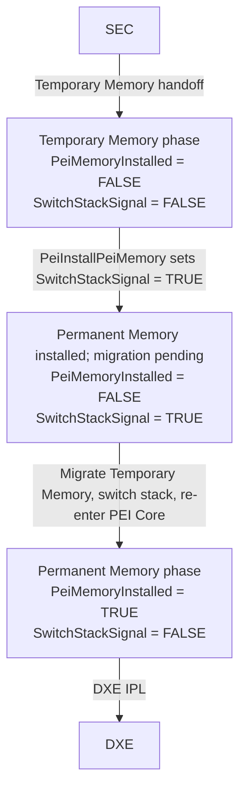
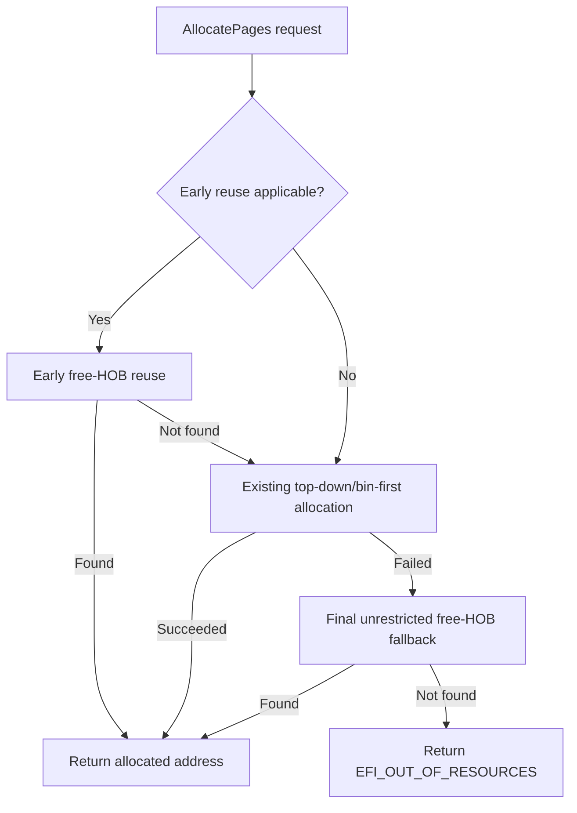

# RFC: Reuse Freed Memory in PEI Core AllocatePages()

## Metadata

- **RFC Number**: TBD
- **Title**: Reuse Freed Memory in PEI Core AllocatePages()
- **Status**: Draft

## Change Log

- 2026-10-01: Initial version.
- 2026-10-01: Narrowed the proposal to Temporary Memory allocation and selected event-gated
  reuse as the primary solution.
- 2026-10-03: Refined the sticky `TemporaryMemoryPagesFreed` flag, clarified Temporary Memory
  exhaustion and padding-HOB reuse, expanded test coverage, selected best-fit HOB reuse for
  early and final searches, clarified PEI phase priorities and the proposed host-test scope,
  and added a SEC-to-DXE boot-phase diagram.

## Motivation

**Problem statement:** While PEI uses Temporary Memory, allocations can exhaust the active top-down free-memory range
even while suitable pages remain in conventional-memory HOBs after `PeiFreePages()` or allocation-alignment
padding. The allocator searches those HOBs only after top-down allocation fails, so it can consume the limited
temporary-memory range before reusing pages already made available.

This proposal adds a best-fit HOB search before top-down allocation, gated by the sticky
`TemporaryMemoryPagesFreed` flag, set after a successful `PeiFreePages()` call while PEI uses
Temporary Memory or creation of a Temporary Memory padding HOB. The early search runs only while
`SwitchStackSignal` is `FALSE` and `PeiMemoryInstalled` is
`FALSE`. `PeiInstallPeiMemory()` sets `SwitchStackSignal` to `TRUE`. While `SwitchStackSignal` remains
`TRUE` and `PeiMemoryInstalled` remains `FALSE`, allocation uses the active physical-memory range before the
existing final unrestricted HOB fallback. Permanent Memory top-down/bin-first priority is unchanged. The early and
final searches share the best-fit helper.

The HOB list grows upward from `EfiFreeMemoryBottom`, while top-down page allocation lowers `EfiFreeMemoryTop`.
A suitable freed range can therefore remain unavailable to top-down allocation until that range is searched.

The PHIT free-memory layout illustrates how these frontiers approach each other:

```text
High addresses
    +------------------------------+
    | Top-down page allocations    |
    +------------------------------+ EfiFreeMemoryTop moves down
    |                              |
    | Remaining PHIT free gap      |
    |                              |
    +------------------------------+ EfiFreeMemoryBottom moves up
    | HOB list grows upward        |
    +------------------------------+
Low addresses
```

## Technology Background

The PHIT describes the default free-memory range. During the Temporary Memory phase, PEI top-down allocation consumes
free pages from the high end of the active range. The HOB list grows from the low end of the PHIT, so suitable
freed ranges can remain stranded in allocation HOBs instead of being reclaimed by top-down allocation.

`SwitchStackSignal` is initialized to `FALSE` when PEI Core memory services are initialized. While PEI uses
Temporary Memory, `PeiMemoryInstalled` is also `FALSE`, so no stack switch is pending. `PeiInstallPeiMemory()`
records the Permanent Memory range and sets `SwitchStackSignal` to `TRUE`; until Temporary Memory migration and
the stack switch complete, `PeiMemoryInstalled` remains `FALSE`. On PEI Core re-entry after migration,
`PeiMemoryInstalled` is `TRUE` and memory-service initialization sets `SwitchStackSignal` back to `FALSE`.
Therefore, the early-reuse state is specifically `PeiMemoryInstalled = FALSE` and
`SwitchStackSignal = FALSE`; `SwitchStackSignal = FALSE` by itself does not identify the Temporary Memory phase.

The usual boot path through these states is shown below. In the `TRUE` state, Permanent Memory is installed,
but Temporary Memory migration and stack switching are pending.



Platforms that hand PEI already-installed Permanent Memory may enter directly in the Permanent Memory state.

PEI memory bins are initialized only after Permanent Memory is installed, so they are outside the Temporary Memory
exhaustion problem addressed by the early search. They are mentioned here only to identify the Permanent Memory
bin-first priority that remains unchanged. The final fallback is separate from that path: it searches
conventional-memory HOBs without range restrictions.

## Goals

1. Reuse suitable freed pages before consuming the active top-down free range only while
   `PeiMemoryInstalled` and `SwitchStackSignal` are both `FALSE`.
2. Skip the early HOB search while `TemporaryMemoryPagesFreed` is `FALSE`; set it after a successful
   `PeiFreePages()` call while PEI uses Temporary Memory or creation of an allocation-alignment padding HOB.
3. Select the smallest suitable free HOB during early and final searches, preserving HOB-list order for ties
   and honoring allocation granularity rules.
4. Preserve Permanent Memory top-down/bin-first priority while allowing best-fit selection in the final fallback
   to change the selected HOB and returned address.
5. Preserve the existing unrestricted final fallback, including reuse of ranges outside the active bin and
   ranges formed by coalescing adjacent free HOBs.
6. Avoid changing PEI service interfaces, HOB formats, or platform configuration requirements.

## Requirements

1. Search conventional-memory allocation HOBs before top-down allocation only while `PeiMemoryInstalled` and
   `SwitchStackSignal` are both `FALSE` and `TemporaryMemoryPagesFreed` is `TRUE`.
2. Select the smallest suitable HOB in every free-HOB search, keeping HOB-list order for equal-sized
   candidates. Preserve page rounding, granularity checks, adjacent-range coalescing, and unused fragments.
3. Set `TemporaryMemoryPagesFreed` to `TRUE` after a successful `PeiFreePages()` call while PEI uses Temporary
   Memory or creation of an allocation-alignment padding HOB in Temporary Memory.
4. If the early search finds no suitable range or `TemporaryMemoryPagesFreed` is `FALSE`, continue through the
   existing top-down allocation flow.
5. Keep the final free-HOB fallback unrestricted. While Permanent Memory installation has requested the
   stack switch (`SwitchStackSignal = TRUE`, `PeiMemoryInstalled = FALSE`), preserve active physical-memory
   top-down allocation. In the Permanent Memory state (`PeiMemoryInstalled = TRUE`, `SwitchStackSignal = FALSE`),
   preserve top-down/bin-first priority; the final fallback uses the
   smallest-suitable-HOB policy.
6. From the time `PeiInstallPeiMemory()` sets `SwitchStackSignal` to `TRUE` until Temporary Memory migration
   completes and `PeiMemoryInstalled` becomes `TRUE`, suppress the early HOB search while retaining the
   existing final fallback.

## UEFI/PI Specification Impact

The proposed change is internal to the PEI Core allocator and would not modify UEFI or PI specification
behavior. It would not require a Code First issue or a specification update.

## Backward Compatibility

The proposal would not change public PEI service interfaces, HOB formats, or platform settings. While PEI uses
Temporary Memory (`PeiMemoryInstalled = FALSE`, `SwitchStackSignal = FALSE`), allocation addresses could differ because
the allocator may reuse a suitable freed range before moving the active top-down free boundary. In the
transition state (`PeiMemoryInstalled = FALSE`, `SwitchStackSignal = TRUE`), allocation uses the active
physical-memory range while Temporary Memory migration is pending. After migration, PEI uses Permanent Memory
with `PeiMemoryInstalled = TRUE`, `SwitchStackSignal = FALSE`, and normal top-down/bin-first priority remains
unchanged. If allocation reaches the final unrestricted HOB fallback, best-fit selection may choose a different
HOB and return a different address.

The early search would introduce no new memory-bin policy, and the final fallback would remain unrestricted.
No platform migration would be required.

## Platform/Package Impact

The proposal targets `MdeModulePkg` PEI Core memory services. Platforms using PEI `AllocatePages()` may
observe different allocation addresses and reduced consumption of the PHIT free-memory range. No platform
DSC, PCD, or HOB producer changes are proposed.

## Unresolved Questions

None at this time. The proposal is open to review of its Temporary Memory scope and fallback ordering.

## Prior Art/Related Work

The existing PEI Core allocator searches free memory-allocation HOBs after top-down allocation fails. This
proposal reuses that path and helper, changes candidate selection to best-fit, and invokes the helper earlier
only while `PeiMemoryInstalled = FALSE` and `SwitchStackSignal = FALSE` and after a successful free while PEI
uses Temporary Memory or padding HOB creation. The final HOB search remains unrestricted. Permanent Memory
top-down/bin-first priority is preserved, and no separate implementation of this early-search policy is known.

## Alternatives

### Alternative 1: Keep top-down allocation before searching free HOBs

- **Pros**: Preserves existing allocation order.
- **Cons**: It can consume active top-down pages before reusing suitable free HOBs, increasing Temporary Memory
  pressure. If top-down allocation fails, the existing unrestricted HOB fallback may still satisfy the
  request. Normal top-down allocations still require allocation HOBs.
- **Boot performance**: Avoids the proposed early HOB-list scans; the existing unrestricted fallback still
  scans when top-down allocation fails.
- **Why not chosen**: The targeted Temporary Memory event gate limits scan overhead while allowing reuse before
  Temporary Memory pressure becomes critical.

### Alternative 2: Track minimum free size to skip HOB searches

- **Pros**: Adding a minimum-size threshold could avoid searches when tracked free ranges are individually
  too small for the request.
- **Cons**: A minimum individual free size does not describe current contiguous HOB ranges. Smaller adjacent
  frees may coalesce into a suitable range, and alignment padding may create a conventional-memory HOB
  without a `FreePages()` call. The threshold can therefore suppress a useful search or become stale as
  allocations split and consume ranges.
- **Boot performance**: Can skip HOB-list scans when tracked ranges cannot satisfy a request, reducing search
  work at the cost of threshold bookkeeping; a false skip can miss adjacent or padding-HOB ranges.
- **Why not chosen**: The `TemporaryMemoryPagesFreed` Boolean is simpler and avoids the threshold's false negatives;
  the existing HOB search determines whether a suitable contiguous range actually exists.

### Alternative 3: Coalesce free HOBs eagerly

- **Pros**: Can merge adjacent conventional-memory HOBs as soon as pages are freed, reducing descriptor
  count and making larger contiguous ranges immediately visible.
- **Cons**: Adds work to the free path even if the merged range is never reused, and does not itself reclaim
  additional page bytes or move the active top-down free boundary.
- **Boot performance**: Moves coalescing work to page frees; fewer descriptors may make later HOB searches
  cheaper, but the free-path cost is paid even when the range is never reused.
- **Why not chosen**: The existing search coalesces adjacent HOBs on demand, so eager merging is unnecessary
  for the selected `TemporaryMemoryPagesFreed`-gated search while PEI uses Temporary Memory.

## Selected Solution

While PEI uses Temporary Memory (`PeiMemoryInstalled = FALSE`, `SwitchStackSignal = FALSE`),
`AllocatePages()` would search
conventional-memory HOBs before consuming the active top-down free range only when `TemporaryMemoryPagesFreed` is
`TRUE`. A successful `PeiFreePages()` call while PEI uses Temporary Memory or creation of an
allocation-alignment padding HOB would
set `TemporaryMemoryPagesFreed` to `TRUE`. Padding pages use the same free-memory HOB type, so consumers
cannot distinguish them from ranges freed by `PeiFreePages()`. The helper would choose the smallest suitable
HOB in both the early search and the final unrestricted fallback. Equal-sized candidates would retain HOB-list
order.

While the stack switch to Permanent Memory is pending (`PeiMemoryInstalled = FALSE`, `SwitchStackSignal = TRUE`),
the early search would be disabled and allocation would use the active physical-memory range first, while the
existing final unrestricted fallback remains available. After migration, PEI uses Permanent Memory with
`PeiMemoryInstalled = TRUE` and `SwitchStackSignal = FALSE`; normal top-down/bin-first priority remains.

- **Pros**: May reduce Temporary Memory use versus current top-down-first behavior when a suitable HOB satisfies a
  request before the active range is consumed.
- **Cons**: Splitting HOBs may require descriptors for unused fragments; unused slots are reused first.
- **Boot-performance impact**: The event gate avoids early HOB scans until a successful free or padding-HOB
  creation. The shared best-fit search must inspect eligible HOBs to find the smallest fit, so search cost
  grows with the HOB list, including in the final fallback. The sticky flag remains set, so later requests may
  rescan even when no suitable range remains.

## Implementation Design

### Architecture Overview

The proposed flow adds an optional early free-HOB reuse stage before the existing allocation path. If that
stage does not satisfy the request or is not applicable, allocation continues through the existing
top-down/bin-first flow and retains the final unrestricted free-HOB fallback.



### Detailed Design

The proposed Temporary Memory path would call the existing
`FindFreeMemoryFromMemoryAllocationHob()` helper before top-down allocation only when
`PeiMemoryInstalled = FALSE`, `SwitchStackSignal = FALSE`, and `TemporaryMemoryPagesFreed = TRUE`. A successful
`PeiFreePages()` call while PEI uses Temporary Memory or creation of an allocation-alignment padding
HOB would set the flag. It
would remain `TRUE` after ranges are consumed; it records that reusable free HOBs may exist, not whether a
suitable range currently exists. HOB-list consumers cannot distinguish padding pages from pages freed by
`PeiFreePages()`. The helper would select the smallest suitable HOB, retaining HOB-list order for equal-sized
candidates. It would preserve page/granularity handling, adjacent conventional-memory coalescing, and HOB
update/split behavior. The final unrestricted fallback would use the same smallest-suitable-HOB selection.

After `PeiInstallPeiMemory()` sets `SwitchStackSignal = TRUE` and before Temporary Memory migration completes,
`PeiMemoryInstalled` remains `FALSE`, so the early HOB search is disabled. Allocation uses the active
physical-memory range first, and the existing final unrestricted HOB fallback remains available if that range
cannot satisfy the request. After migration, `PeiMemoryInstalled = TRUE` and memory-service initialization
sets `SwitchStackSignal = FALSE`. This RFC does not change the stack-switch or migration sequence.

`SwitchStackSignal = TRUE` indicates that the transition has been requested, not that the stack switch has
completed. The PEIM that calls `PeiInstallPeiMemory()` continues until it returns; the dispatcher then checks
the signal and performs the switch before dispatching another PEIM. If the service is called from a
dispatch-notify callback, that callback and any remaining callbacks in the current notification drain may run
while `SwitchStackSignal = TRUE` and `PeiMemoryInstalled = FALSE`, before the dispatcher checks the signal
again. The early search remains disabled throughout the pending interval. Allocations preserve top-down priority
within the active physical-memory range instead of preemptively selecting an arbitrary conventional-memory HOB,
which may be outside that range. This restriction applies only to the early priority search. The existing final
unrestricted HOB fallback remains available if allocation from the active range fails.

If no suitable HOB were found, the existing helper could coalesce adjacent conventional-memory HOBs and
retry. If the early search still returned without a candidate, the allocator would continue through its
existing top-down path. Its final unrestricted HOB search would remain available.

The production change would touch `MdeModulePkg/Core/Pei/Memory/MemoryServices.c` and the
`PEI_CORE_INSTANCE` definition in `MdeModulePkg/Core/Pei/PeiMain.h`; host tests would be maintained in
`MdeModulePkg/Core/Pei/GoogleTest/PeiMemoryServicesGoogleTest.cpp`. It would reuse the existing HOB update/split logic
and would not add a PEI service or change HOB structures.

### Code Examples

N/A. This proposal concerns an internal allocator change; callers would continue to use the existing PEI
`AllocatePages()` service.

## Testing Strategy

Implementation validation should include PEI Core host tests with controlled PHIT
bounds and synthetic allocation HOBs. In the unit-test order, validate that:

1. A successful `PeiFreePages()` call while PEI uses Temporary Memory sets
   `TemporaryMemoryPagesFreed`, enables the early search, and allows a suitable freed HOB to be
   reused before top-down allocation. The flag remains `TRUE` after reuse.
2. In the transition state (`PeiMemoryInstalled = FALSE`, `SwitchStackSignal = TRUE`), a suitable HOB and
   `TemporaryMemoryPagesFreed = TRUE` do not bypass the active physical-memory top-down range when it can satisfy
   the request.
3. If the active physical-memory range cannot satisfy a transition-state request, the final unrestricted
   HOB fallback can still satisfy it without changing the active or PHIT free-memory top.
4. The early free-HOB search selects the smallest suitable range, even when a larger suitable HOB appears
   earlier in HOB-list order.
5. Creating a Temporary Memory padding HOB sets `TemporaryMemoryPagesFreed`, and the next allocation
   reuses that HOB
   without consuming more of the temporary-memory free top. The flag remains `TRUE` after reuse.
6. The free-HOB helper honors 4 KiB, 16 KiB, and 64 KiB granularity, including aligned placement and
   preservation of the unused fragment. The X64 host configuration uses 4 KiB for both default and runtime
   allocation granularity, so `TemporaryMemory_PaddingHobReuse` skips on X64. The helper-level test covers all three
   granularities, but does not exercise padding-HOB creation and reuse through `PeiAllocatePages()` at larger
   granularities. Validate that integration path on an architecture or test configuration with runtime
   granularity greater than the default.
7. Without a successful Temporary Memory free or padding-HOB creation,
   `TemporaryMemoryPagesFreed` remains `FALSE`, the early HOB search is skipped, and allocation
   follows the top-down path.
8. In the Permanent Memory state (`PeiMemoryInstalled = TRUE`, `SwitchStackSignal = FALSE`), allocation remains
   top-down-first even when `TemporaryMemoryPagesFreed = TRUE` and the PHIT can satisfy the request.
9. An undersized free HOB leaves allocation to the PHIT free-memory top.
10. An invalid memory type fails without changing the free-memory top.
11. The final unrestricted fallback can reuse a range outside the PHIT.
12. The final unrestricted fallback coalesces adjacent free HOBs when neither range alone can satisfy the
   request.
13. The final unrestricted fallback selects the smallest suitable HOB; equal-sized candidates retain
   HOB-list order.

## Migration/Adoption Plan

1. **Phase 1**: Review and accept the proposed allocator behavior and validation criteria.
2. **Phase 2**: If accepted, develop and validate a POC in `MdeModulePkg`, including host-test coverage.
3. **Phase 3**: No platform migration is proposed; platform maintainers may validate any code that assumes
   a particular successful allocation address.

**POC Target Date**: TBD.

The proposal would add no dependencies or configuration switches. The risk is changed allocation placement; host
regression tests and platform integration testing should mitigate it.

## Guide-Level Explanation

### For Package Developers

The proposal would introduce no new API, and PEI modules would continue to call `AllocatePages()` as before.
While `PeiMemoryInstalled = FALSE` and `SwitchStackSignal = FALSE`, the early free-HOB search would run only
after `TemporaryMemoryPagesFreed` is set by a successful `PeiFreePages()` call or creation of a padding HOB; otherwise
allocation would follow the existing top-down path.

### For Platform Developers

The proposal requires no new memory-bin configuration. Early reuse is limited to PEI using
Temporary Memory and begins after a successful free or padding-HOB creation. A platform may observe
lower Temporary Memory use if a later allocation reuses suitable freed pages before consuming the
active top-down range. During a pending stack switch, allocations use the active physical-memory
range first; after migration to Permanent Memory, top-down/bin-first priority remains unchanged.

### For End Users (if applicable)

There is no direct user-visible change. While `PeiMemoryInstalled = FALSE` and `SwitchStackSignal = FALSE`, the
allocator may avoid consuming temporary-memory pages while suitable freed pages remain available.
