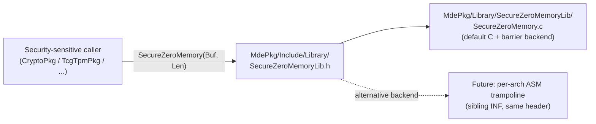

# RFC: Introduce SecureZeroMemoryLib for Securely Erasing Sensitive Buffers

## Metadata

- **RFC Number**: TBD
- **Title**: Introduce SecureZeroMemoryLib for Securely Erasing Sensitive Buffers
- **Status**: Draft
- **Author**: Kun Qin (`@kuqin12`)

## Change Log

- 2026-05-27: Initial RFC created. Motivated by discussion on
  [edk2 PR #12244](https://github.com/tianocore/edk2/pull/12244), with review
  input from `@mdkinney`, `@mikebeaton`, and `@jaykrell`.

## Motivation

EDK II ships two large bodies of security-sensitive code that both
explicitly call `SecureZeroMemory` on their secret material:

- [`CryptoPkg`](https://github.com/tianocore/edk2/tree/master/CryptoPkg)
  is a port of OpenSSL, which calls `SecureZeroMemory` (and
  `OPENSSL_cleanse`) on private keys, key schedules, IVs, and
  intermediate cryptographic state.
- [`TcgTpmPkg`](https://github.com/tianocore/edk2/tree/master/TcgTpmPkg)
  is a port of the Microsoft TPM 2.0 reference implementation, which
  calls `SecureZeroMemory` on TPM session secrets, authorization values,
  and HMAC state.

Neither codebase implements `SecureZeroMemory` itself; both inherit it
from their host C runtime. The compatibility shim that supplies it under
EDK II (in their respective CrtLibSupport.h files) currently provides:

```c
#ifndef SecureZeroMemory
#define SecureZeroMemory(ptr, sz)  memset((ptr), 0, (sz))
#endif
```

Combined with the earlier `#define memset(dest, ch, count)  SetMem(...)`
in the same headers, every `SecureZeroMemory(p, n)` call written by
upstream OpenSSL or the Microsoft TPM reference stack expands, in EDK II
builds, to a plain `SetMem(p, n, 0)`, which is the same as a regular `ZeroMem()`.
The secure-erase intent the upstream authors wrote into their code does not
survive the indirective. This silent downgrade is the gap this RFC attempts to
close.

(EDK II-native code that handles confidential material directly would benefit
from the same primitive being available to call explicitly. That broader native
adoption is in scope for Phase 2 of the Migration plan; the wrapper-layer fix is
what motivates landing the library now.)

As of today, `ZeroMem()` does not carry a security contract. It is defined by
[`BaseMemoryLib.h`](https://github.com/tianocore/edk2/blob/master/MdePkg/Include/Library/BaseMemoryLib.h)
as part of a library that, per its own header doc-comment, "provides
optimized implementations for common memory-based operations". Its writes
are ordinary stores and the call is an ordinary call. An optimizing
compiler is permitted to elide such writes when it can prove the buffer
is not read afterward. This is the well-documented class of bug captured
as [MITRE CWE-14](https://cwe.mitre.org/data/definitions/14.html)
("Compiler Removal of Code to Clear Buffers"), a child of
[CWE-733](https://cwe.mitre.org/data/definitions/733.html) ("Compiler
Optimization Removal or Modification of Security-critical Code").

In firmware, the consequences of leaving secrets resident in DRAM (heap or stack)
are more severe than in user-space applications. Residual secrets can survive
across PEI->DXE->BDS->Runtime handoffs, leak through cold-boot attacks, debug
interfaces, S3 resume residues, SMM save-state areas, page tables, or DMA
inspection. There is no equivalent of process teardown to implicitly recover the
memory.

It is worth noting that the present `ZeroMem()` implementation in
[`MdePkg/Library/BaseMemoryLib/SetMem.c`](https://github.com/tianocore/edk2/blob/master/MdePkg/Library/BaseMemoryLib/SetMem.c)
writes through `volatile UINT8/UINT32/UINT64 *` pointers. That `volatile`
prevents the compiler from replacing the inner loop with an intrinsic
`memset()`. However, it does **not** bind the *call site*. Under inlining,
link-time optimization (LTO), profile-guided optimization (PGO), or whole-program
analysis. A sufficiently capable optimizer can still observe that the
buffer's contents are not read after the call and remove the call (or its
effects) entirely. This RFC is created to close such gap.

## Technology Background

Dead-store elimination (DSE) is a standard, decades-old compiler optimization
that removes stores whose values are never observed. It is correct under the
C abstract machine. ISO/IEC 9899 Section 5.1.2.3 - 4: *Program execution* states
(publicly accessible as the C11 final committee draft
[N1570](https://www.open-std.org/jtc1/sc22/wg14/www/docs/n1570.pdf); the
text is materially unchanged through C17 and C23):

```text
An actual implementation need not evaluate part of an expression if it can deduce that its value is not used and that no needed side effects are produced (including any caused by calling a function or accessing a volatile object).
```

A buffer that is wiped and then never read again satisfies exactly that
test: Once the call to the clearing routine has been inlined and its `volatile`
qualifier no longer binds the call site. The compiler may conclude that no needed
side effects are produced. When the buffer in question held a secret, this is
precisely what produces CWE-14.

The security and compiler communities have converged on the answer for the
last twenty-plus years: provide a *separately-named* memory-clearing API
whose contract is explicitly to defeat the optimizer. Every major platform
and security project ships one:

| Project / standard | Optimization-resistant API | General-purpose API |
| --- | --- | --- |
| Win32 / Microsoft | `SecureZeroMemory` | `ZeroMemory` / `RtlZeroMemory` |
| OpenBSD / glibc / FreeBSD | `explicit_bzero(3)` | `bzero` / `memset` |
| Linux kernel | `memzero_explicit()` | `memset()` |
| ISO C11 Annex K | `memset_s` | `memset` |
| OpenSSL / BoringSSL | `OPENSSL_cleanse` | `memset` |
| mbedTLS | `mbedtls_platform_zeroize` | `memset` |
| libsodium | `sodium_memzero` | `memset` |
| NSS | `PORT_Memset` + explicit volatile wrappers | `memset` |

This table presents a *convergent design under independent constraints*.

EDK II's current position, with only a performance-contracted primitive and a
`CrtLibSupport.h` shim that silently degrades upstream's `SecureZeroMemory` to
it, is the position each previously cited peer has explicitly moved away from.

Standards work and ongoing activity that motivate this proposal:

- **ISO/IEC 9899:2024 (C23), Section 7.24.6.2,
  [`memset_explicit`](https://en.cppreference.com/w/c/string/byte/memset).**
  In 2024 the C standards committee added a new, mandatory (i.e. *not*
  Annex K, *not* optional) `<string.h>` function whose entire reason for
  existing is the contract this RFC asks `SecureZeroMemoryLib` to carry.
  The standard's own footnote on it reads: *"The intention is that the
  memory store is always performed (i.e., never elided), regardless of
  optimizations. This is in contrast to calls to the `memset` function."*
  The proposal that landed it is
  [WG14 N2897](https://www.open-std.org/jtc1/sc22/wg14/www/docs/n2897.htm)
  (Miguel Ojeda, 2021); its motivation section is, in substance, the
  same argument made in this RFC. EDK II inheriting that pattern as a
  library class is consistent with the direction the language itself has
  taken since this RFC's predecessor designs were debated.
- **Zhaomo Yang, Brian Johannesmeyer, Anders Trier Olesen, Sorin Lerner,
  Kirill Levchenko. "Dead Store Elimination (Still) Considered Harmful",
  USENIX Security 2017**
  ([full paper](https://www.usenix.org/system/files/conference/usenixsecurity17/sec17-yang.pdf)).
  Cited by WG14 N2897 above as part of the empirical justification for
  standardizing `memset_explicit`. Surveys eleven open-source security
  projects; finds four use scrubbing techniques that fail to scrub and
  another four use their scrubbing function inconsistently; documents
  that effectiveness varies across compiler versions for the same
  source code. The techniques the paper catalogues as *failing* are
  the same techniques `ZeroMem()` uses today.
- **CERT C secure coding rule
  [MSC06-C: Beware of compiler optimizations](https://web.archive.org/web/20230924213516/https://wiki.sei.cmu.edu/confluence/display/c/MSC06-C.+Beware+of+compiler+optimizations)**
  (Wayback Machine snapshot; the SEI confluence wiki has since been
  retired). Identifies `memset()` of sensitive data as a noncompliant
  pattern that compilers are entitled to remove, and names
  `SecureZeroMemory()` as the canonical Windows-platform compliant
  solution.
- **GCC bug [#8537](https://gcc.gnu.org/bugzilla/show_bug.cgi?id=8537),
  "memset() optimized away"**: Resolved as WONTFIX. Per the language
  standard the compiler is correct to remove dead stores, so a separately
  contracted API is required. This is the toolchain-side position the
  C23 committee accepted when it added `memset_explicit` rather than
  attempting to constrain `memset` itself. The conclusion has been
  stable across the ecosystem for two decades and was ratified at the
  standards level in 2024.

## Goals

1. Provide an EDK II base library interface whose contract is: *the buffer will
   be zeroed in memory, and the writes will not be elided or reordered away by
   the optimizer, regardless of how the call site is inlined or whole-program
   optimized.*
2. Preserve `BaseMemoryLib::ZeroMem()`'s existing performance contract
   unchanged.
3. Match the call shape of EDK II callers and ported third-party
   code to ensure that the code adoption is mechanical.
4. Permit per-architecture replacement of the default C implementation
   (e.g. an assembly trampoline) without altering the public API or its
   consumers.

## Requirements

1. A new library class, `SecureZeroMemoryLib`, MUST publish a single public
   entry point:

   ```c
   VOID *
   EFIAPI
   SecureZeroMemory (
     OUT VOID   *Buffer,
     IN  UINTN  Length
     );
   ```

   matching the header already proposed in
   [`MdePkg/Include/Library/SecureZeroMemoryLib.h`](https://github.com/tianocore/edk2/pull/12244/files).
2. The implementation MUST NOT be elidable from a call site under
   compiler inlining, LTO, IPO, or PGO. Achieved via a combination of
   `noinline`, volatile-qualified stores, and explicit
   compiler-fence barriers, as in the implementation proposed in
   [`MdePkg/Library/SecureZeroMemoryLib/SecureZeroMemory.c`](https://github.com/tianocore/edk2/pull/12244/files).
3. `SecureZeroMemory()` MUST be a no-op (returning `Buffer`) when `Buffer`
   is `NULL` *or* `Length` is `0`, matching the defensive shape of the
   industry analogues.
4. The library MUST be usable from BASE, SEC, PEI, DXE, SMM/MM, and Runtime
   phases. No boot-services dependency, no PCD, no global state.
5. The interface MUST permit alternative backend implementations (notably a
   per-architecture assembly trampoline) to be dropped in via a different
   INF without changing callers or the public header.
6. The documentation comment on `ZeroMem()` in
   [`MdePkg/Include/Library/BaseMemoryLib.h`](https://github.com/tianocore/edk2/blob/master/MdePkg/Include/Library/BaseMemoryLib.h)
   MUST be amended to explicitly state that `ZeroMem()` does not carry a
   secure-erase contract and to direct callers handling confidential
   material to `SecureZeroMemory()`. This is a documentation-only change and
   `ZeroMem()`'s signature and behavior are unaltered.

## UEFI/PI Specification Impact

None. This RFC introduces an EDK II-internal library class. It does not
modify, extend, or constrain any UEFI or PI specification interface, and
does not require a Code First issue.

## Backward Compatibility

This is an additive change.

- No existing API is modified or removed. `ZeroMem()` keeps its current
  signature, behavior, and performance characteristics.
- No callers are broken. Existing `ZeroMem()` call sites continue to
  compile and run identically.
- Initial adopters in
  [`CryptoPkg/Library/Include/CrtLibSupport.h`](https://github.com/tianocore/edk2/blob/master/CryptoPkg/Library/Include/CrtLibSupport.h)
  and
  [`TcgTpmPkg/Private/Include/Standard/CrtLibSupport.h`](https://github.com/tianocore/edk2/blob/master/TcgTpmPkg/Private/Include/Standard/CrtLibSupport.h)
  today contain:

  ```c
  #ifndef SecureZeroMemory
  #define SecureZeroMemory(ptr, sz)  memset((ptr), 0, (sz))
  #endif
  ```

  i.e. they are already calling out for this primitive and silently
  falling back to a non-secure `memset` on EDK II builds. The proposed
  changes wire those calls to the real implementation.
- Platforms that integrate modules consuming the new class MUST add a
  library mapping to their DSC (see Platform/Package Impact, below).
  Platforms that do not consume the class are unaffected.

There is no deprecation in this RFC. A future change may consider
auditing remaining `ZeroMem()` sites that handle sensitive data, but
that is out of scope here and would not be a forced migration.

## Platform/Package Impact

Files added (proposed in [PR #12244](https://github.com/tianocore/edk2/pull/12244)):

- `MdePkg/Include/Library/SecureZeroMemoryLib.h`
- `MdePkg/Library/SecureZeroMemoryLib/SecureZeroMemoryLib.inf`
- `MdePkg/Library/SecureZeroMemoryLib/SecureZeroMemory.c`

Files modified:

- `MdePkg/MdePkg.dec`: register the new library class.
- `MdePkg/MdePkg.dsc`: provide the default implementation mapping for
  the package's own self-build.
- `MdePkg/Include/Library/BaseMemoryLib.h`: doc-comment amendment on
  `ZeroMem()` per Requirement 6 (no signature change).
- `CryptoPkg/Library/Include/CrtLibSupport.h`: replace the fallback
  `#define SecureZeroMemory ... memset(...)` with an `#include` of the
  new header.
- `TcgTpmPkg/Private/Include/Standard/CrtLibSupport.h`: same pattern.

Platform integration: platforms that build any module consuming
`SecureZeroMemoryLib` (initially: any platform building `CryptoPkg`
or `TcgTpmPkg` modules) MUST add to their DSC:

```ini
[LibraryClasses]
  SecureZeroMemoryLib|MdePkg/Library/SecureZeroMemoryLib/SecureZeroMemoryLib.inf
```

Per-architecture alternative backends (e.g. an assembly trampoline) MAY
be provided in a follow-up by adding sibling INFs or source files under the same
library directory; the public header is shared.

## Unresolved Questions

1. **Default backend vs. ASM trampoline.** Should the canonical default
   implementation under `MdePkg` remain the C-with-barriers form proposed
   here, with per-architecture ASM-trampoline backends added incrementally
   as a follow-up? Or should an ASM trampoline ship as part of this RFC's
   initial implementation? See Alternatives below for the trade-off
   surfaced by `@jaykrell`.
2. **Audit scope.** Should this RFC also commit to a tree-wide audit of
   existing `ZeroMem()` call sites that handle confidential material, or
   should that audit be tracked as separate, package-scoped follow-up work
   (recommended)?
3. **Sibling primitives.** A constant-time `SecureCompareMem` is an
   adjacent and frequently-needed primitive for the same security domain
   (defending against timing side channels in MAC/hash comparisons). It is
   intentionally out of scope for this RFC; should it be proposed as a
   separate RFC, or folded in here?

## Prior Art / Related Work

The pattern proposed here is the same pattern used by every comparable
project. The canonical references:

- **Microsoft `SecureZeroMemory`**:
  <https://learn.microsoft.com/en-us/windows/win32/api/winbase/nf-winbase-securezeromemory>.
  Documented since Windows 2000 as "a pointer to the starting address of
  the block of memory to fill with zeros. ... use this function instead
  of `ZeroMemory` when ... the application can be vulnerable to
  attack."
- **OpenBSD `explicit_bzero(3)`**:
  <https://man.openbsd.org/explicit_bzero.3>.
  Introduced specifically because "the compiler may decide that
  [`bzero`] can be removed entirely."
- **Linux kernel `memzero_explicit()`**: declared in
  [`include/linux/string.h`](https://git.kernel.org/pub/scm/linux/kernel/git/torvalds/linux.git/tree/include/linux/string.h),
  introduced by commit
  [`d4c5efdb9777`](https://git.kernel.org/pub/scm/linux/kernel/git/torvalds/linux.git/commit/?id=d4c5efdb97773f59a2b711754ca0953f24516739)
  ("random: add and use memzero_explicit()") with the rationale
  "to make sure to clear the data in the most paranoid way possible".
- **OpenSSL `OPENSSL_cleanse`**:
  [`crypto/mem_clr.c`](https://github.com/openssl/openssl/blob/master/crypto/mem_clr.c).
- **BoringSSL `OPENSSL_cleanse`**:
  [`crypto/mem.c`](https://boringssl.googlesource.com/boringssl/+/refs/heads/main/crypto/mem.c).
- **mbedTLS `mbedtls_platform_zeroize`**:
  [`library/platform_util.c`](https://github.com/Mbed-TLS/mbedtls/blob/development/library/platform_util.c).
  The header comment is worth reading in full; it walks through exactly
  the same trade-offs being debated in PR #12244.
- **libsodium `sodium_memzero`**:
  <https://doc.libsodium.org/memory_management#zeroing-memory>.
- **ISO/IEC 9899:2011 Annex K `memset_s`**: K.3.7.4.1. Standardized
  precisely to give portable C programs a guaranteed-not-elided clearing
  primitive. (Note that Annex K adoption is itself contested in the
  toolchain community, which reinforces the case for EDK II providing its own
  contract-bearing API rather than relying on the C library.)

Within EDK II, prior discussion:

- [PR #12244](https://github.com/tianocore/edk2/pull/12244) is the
  source of this RFC. The PR contains the candidate implementation referenced
  throughout.
- Review comments from `@mdkinney` raised the question this RFC is
  written to answer; review comments from `@jaykrell` (cited again
  under Alternatives below) provide compiler-team-side context that
  materially supports the proposal. `@mikebeaton`'s position that
  "`ZeroMem` itself should be guaranteed" motivated Requirement 6.

## Alternatives

### Alternative 1: Add compiler barriers inside `ZeroMem` itself

- **Pros**: One fewer API; existing call sites benefit automatically.
- **Cons**:
  1. Silently couples a *security* contract onto a primitive whose
     documented contract is *performance*. Every caller of `ZeroMem`,
     including high-frequency, non-security uses, pays the optimization-
     suppression cost. The two contracts are intentionally distinct everywhere
     else in the industry.
  2. It does not solve the strongest form of the problem. When the
     compiler can prove (under inlining/LTO) that a buffer is dead after
     the function returns, it can still elide the *call* and putting
     a barrier inside `ZeroMem` does not change that, because the call
     itself becomes inlined. The mechanism that actually prevents
     call-site elision is having a function whose body the optimizer
     *cannot inline through*; that is precisely what a separately-named
     `noinline` function buys.
  3. It conflates documentation: any future reader of `BaseMemoryLib`
     would have to reason about two contracts under one name. The
     industry has already learned that lesson.

### Alternative 2: Require callers to mark buffers `volatile` themselves

- **Pros**: Zero new code.
- **Cons**: Error-prone; "viral" (the qualifier infects every pointer
  expression touching the buffer); easy to forget at one of the dozens
  of call sites. Yang et al. (USENIX 2017) measured this and found
  inconsistent effectiveness across compiler versions even when applied
  correctly.

### Alternative 3: Per-architecture assembly trampoline

- **Pros**: As `@jaykrell` notes on PR #12244, this is the strongest
  available barrier: compiler developers have stated they are not
  willing to be blind to `no-lto`, and a single-instruction assembly
  trampoline (`jmp memset`) is what production security-conscious code
  uses to keep the optimizer from seeing through the call.
- **Cons**: More code per supported architecture (IA32, X64, AARCH64,
  ARM, RISCV64, LOONGARCH64, EBC).
- **Why not chosen as the initial backend**: The library class proposed
  by this RFC is **explicitly designed to allow such a backend to be
  dropped in later as a separate INF without changing callers or the
  public header.** Landing the interface with the portable C-with-barriers
  default unblocks immediate adoption (CryptoPkg, TcgTpmPkg) and leaves
  the per-arch ASM as a follow-up that can proceed in parallel.

### Alternative 4: Do nothing; rely on present `ZeroMem`

- **Pros**: Zero work.
- **Cons**: Knowingly leaves CWE-14 exposure in code that handles
  cryptographic and authentication secrets, while every cited project
  has migrated away from this position over the last 20+ years. The
  Yang et al. (USENIX 2017) paper specifically documents this pattern of
  "we'll just use `memset` / `bzero` / `ZeroMem`" producing exploitable residues.

## Implementation Design

### Architecture Overview



One function interface. Multiple backends permitted; one default backend in
this RFC. Public header is the single integration surface.

### Detailed Design

The proposed default implementation (full source in PR #12244) layers
three independent mechanisms, each defeating a different optimizer
behavior:

1. **`noinline` wrapper**: `SZM_NOINLINE` expands to
   `__declspec(noinline)` on MSVC and `__attribute__((noinline))` on
   GCC/Clang. This forces the optimizer to retain a real call boundary
   the IPA/LTO passes cannot trivially see through.
2. **`volatile`-qualified store loop**: writes go through
   `volatile UINT8 *`, which forbids the compiler from substituting an
   intrinsic that "knows" the post-state is dead, and prevents the
   stores within the function body from being elided.
3. **Compiler-fence barrier**: `SecureZeroMemoryBarrier(Buffer)`
   emits `_ReadWriteBarrier()` on MSVC and
   `__asm__ __volatile__("" : : "r"(Buffer) : "memory")` on GCC/Clang.
   This both reads `Buffer` (defeating "the buffer is unused" reasoning)
   and clobbers memory (defeating reordering of any post-call use). It
   is emitted both inside the noinline worker and at the public entry
   point's return path.

Combined, these mean that to elide the writes, the compiler would have
to (a) inline through a `noinline` boundary, (b) reason past a volatile
store, and (c) ignore an asm-clobber barrier. No mainstream toolchain
currently does all three; the asm-trampoline alternative remains
available as a future hardening step (Alternative 3).

### Code Examples

Canonical caller pattern:

```c
#include <Library/SecureZeroMemoryLib.h>

EFI_STATUS
EFIAPI
DeriveAndUseKey (
  IN  CONST UINT8  *Seed,
  IN  UINTN        SeedLength,
  OUT UINT8        *Output,
  IN  UINTN        OutputLength
  )
{
  UINT8  Key[32];
  EFI_STATUS  Status;

  Status = DeriveKeyFromSeed (Seed, SeedLength, Key, sizeof (Key));
  if (EFI_ERROR (Status)) {
    SecureZeroMemory (Key, sizeof (Key));
    return Status;
  }

  Status = EncryptWithKey (Key, sizeof (Key), Output, OutputLength);

  //
  // Wipe the key on every exit path, including success.
  // ZeroMem here would be eligible for dead-store elimination because
  // Key is not read after this point.
  //
  SecureZeroMemory (Key, sizeof (Key));
  return Status;
}
```

Platform DSC integration:

```ini
[LibraryClasses]
  SecureZeroMemoryLib|MdePkg/Library/SecureZeroMemoryLib/SecureZeroMemoryLib.inf
```

## Testing Strategy

- **Build verification** across all supported toolchains and
  architectures in TianoCore CI (the existing
  `MdePkg.ci.yaml` / `MdePkg.dsc` matrix), confirming the new INF
  compiles without warnings under `-Werror`-class settings.
- **Host-based unit test** (under `UnitTestFrameworkPkg`) that calls
  `SecureZeroMemory()` on initialized buffers of varying alignment and
  length (including `Length == 0` and `Buffer == NULL`) and asserts
  the post-call contents. This verifies that the *contract* of "the buffer is
  observably zero on return".
- **Disassembly inspection**, performed manually during development on
  the supported toolchains, confirming that the call survives `-O2`
  (and `-O3 -flto` for GCC/Clang, `/O2 /GL` for MSVC) builds of
  representative call sites in `CryptoPkg`.
- **What we deliberately do not promise**: a CI test that "proves"
  optimization-induced elision on a specific compiler build. As Yang
  et al. document, such a test would be a brittle indicator of one
  toolchain version's behavior, not a stable measurement of the
  library's contract. The guarantee provided by this library is
  *structural* (noinline + volatile + barrier), and is validated by
  the structure of the implementation rather than by empirical
  observation against a snapshot toolchain.

## Migration / Adoption Plan

1. **Phase 1: Land the library and initial adopters.** Merge
   [PR #12244](https://github.com/tianocore/edk2/pull/12244) once this
   RFC is accepted:
   - New `SecureZeroMemoryLib` class and default backend in `MdePkg`.
   - `CryptoPkg` and `TcgTpmPkg` `CrtLibSupport.h` switched from the
     `#define SecureZeroMemory ... memset(...)` fallback to the real
     library.
   - `ZeroMem()` doc-comment amendment in
     `MdePkg/Include/Library/BaseMemoryLib.h` per Requirement 6.
2. **Phase 2: Opportunistic adoption.** Package maintainers audit and
   convert `ZeroMem()` call sites that handle confidential material
   in their packages, scoped per-package, on their own schedule.
   Suggested initial targets: `SecurityPkg`,
   `MdeModulePkg/Library/AuthVariableLib`, `NetworkPkg/Tls*`,
   `CryptoPkg/Library/BaseCryptLib` direct callers.

Risk mitigation: each step is additive and gated by individual PR
review. The absence of adoption in any given package is functionally equivalent
to today, not a regression.

## Guide-Level Explanation

### For Package Developers

Use `SecureZeroMemory()` instead of `ZeroMem()` when the buffer
contains material whose disclosure would constitute a security failure:

- Cryptographic keys, key schedules, IVs, nonces in their secret form.
- Plaintext that has just been decrypted.
- TPM authorization values, session keys, HMAC keys.
- User credentials, passwords, PINs.
- RNG internal state.
- Any buffer whose contents you are wiping *because they are sensitive*
  rather than *because the next use needs zero-initialized memory*.

Use `ZeroMem()` elsewhere. The distinction is the *reason* for
the initialization vs. the erasure.

### For Platform Developers

Add the library mapping to your platform DSC:

```ini
[LibraryClasses]
  SecureZeroMemoryLib|MdePkg/Library/SecureZeroMemoryLib/SecureZeroMemoryLib.inf
```

Should a future RFC adds a per-architecture ASM-trampoline backend, a new INF
path can be used to opt into it.

### For End Users

No visible behavior change.
