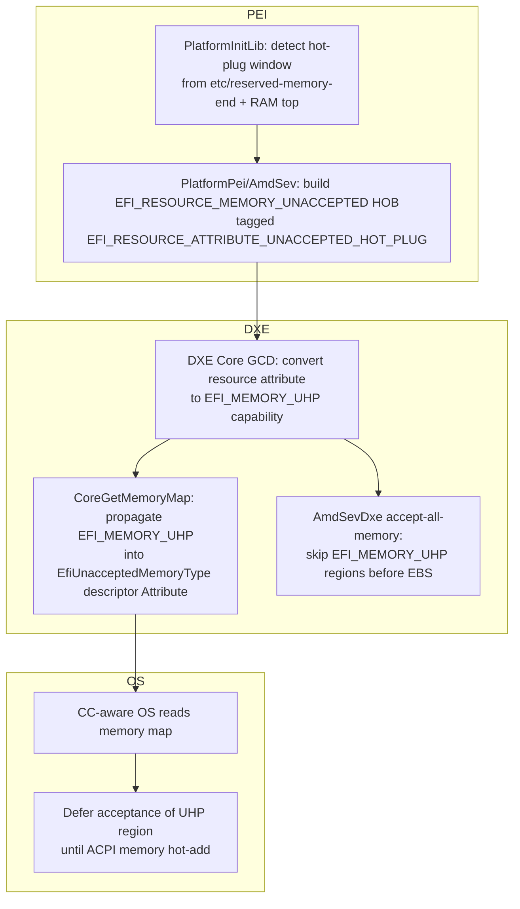

# RFC: Unaccepted Hot-Plug Memory Attribute

## Metadata

- **RFC Number**: TBD
- **Title**: Unaccepted Hot-Plug Memory Attribute
- **Status**: Draft

## Change Log

- 2026-07-15: Initial RFC created.

## Motivation

Confidential computing (CC) guests such as AMD's SEV-SNP (Secure Encrypted Virtualization-Secure Nested Paging) and Intel's TDX (Trust Domain Extensions) boot with most of their memory in an *unaccepted* state. Before such memory can be used it must be "accepted" (validated) by the guest via architectual specific mechanims such as AMD's `PVALIDATE` and Intel's `TDCALL[TDG.MEM.PAGE.ACCEPT]`. UEFI 2.9 introduced `EfiUnacceptedMemoryType` and the `EFI_UNACCEPTED_MEMORY` resource so firmware can hand unaccepted memory to a CC-aware OS, which then accepts it lazily or eagerly.

Memory hotplug on a guest can be configured by the VMM (e.g. QEMU `-m <mem>,maxmem=<maxmem>`) and the firmware describes that window to the OS via the ACPI SRAT table. In the OS, the unaccepted-memory table is allocated early in boot, sized from the ranges described by the `EFI_UNACCEPTED_MEMORY` type. Hotplug memory ranges are parsed later, during ACPI setup, and are therefore not included in the initial table. As a result, when memory is hot-added, the unaccepted-memory infrastructure is unaware of the range and cannot accept it, causing the guest to panic when that memory is touched.

The current OS workaround proposed for this missing information is to accept the memory up-front when it is hot-added and to revert the acceptance when it is hot-removed. However, because unaccepted pages are no longer tracked, this approach has two drawbacks: first, it loses the ability to accept memory lazily; second, when memory is partially removed and re-added there is no way to know which pages were previously accepted, and double acceptance of a page is architecturally disallowed on AMD's SEV-SNP (and is likewise an issue on Intel's TDX too). See the [Linux kernel implementation and discussion on LKML](https://lore.kernel.org/all/20260203174946.1198053-1-prsampat@amd.com/).

There is currently no architectural mechanism for firmware to communicate guest memory ranges that are unaccepted, are part of the hot-plug window, and do not have backing pages yet. This RFC proposes a new attribute, `EFI_MEMORY_UHP`, that hints to the OS to account for hot-added memory when sizing the unaccepted-memory table, while accepting that memory only once it has a backing store or just before it is used.

## Technology Background

CC VM memory acceptance: memory acceptance is a common requirement across confidential-computing architectures. On AMD's SEV-SNP, guests perform an architectural validation step using the `PVALIDATE` instruction, which sets the Validated bit in the page's RMP (Reverse Map Table) entry, establishing it as guest-private memory. Intel's TDX provides an analogous step: the guest issues `TDCALL[TDG.MEM.PAGE.ACCEPT]`, and the equivalent per-page state is tracked by the TDX module in the Secure EPT. In both cases the intent is to enforce the cryptographic ownership and integrity model for guest memory so that a page must be accepted before the guest can safely use it as private memory.

Unaccepted memory: accepting all memory up-front at boot is slow and largely wasteful, since most of that memory will not be used immediately. The core idea of the unaccepted-memory infrastructure is for firmware to mark memory that requires acceptance with `EfiUnacceptedMemoryType`; the OS then tracks this memory and validates each region only when it is about to be touched.

QEMU memory hot-plug: when `maxmem > mem`, QEMU reserves a hot-plug window above the cold-plugged RAM and exposes its exclusive end address via the `etc/reserved-memory-end` fw_cfg file. QEMU DIMMs added later are advertised to the OS through ACPI.

ACPI hotplug: SRAT memory-affinity structures expose hot-pluggable memory and carry a "Hot Pluggable" flag. However, in the OS, unaccepted memory is parsed early in boot during EFI structure allocation, whereas the ACPI SRAT is parsed later in the boot cycle. This is why the early EFI memory structures do not contain any hotplug memory information.

Existing analog - `EFI_MEMORY_HOT_PLUGGABLE`: UEFI already defines a hint bit for conventional memory that may be dynamically removed, advising the OS not to place non-relocatable data there. Because `EFI_MEMORY_HOT_PLUGGABLE` is intended for cold-plugged pages that could be removed rather than hot-plugged pages that do not exist yet, re-using this attribute would require a change to its definition at the cost of backward compatibility.

## Goals

1. Allow firmware to mark an unaccepted memory region as belonging to a memory hot-plug window, distinct from present-but-unvalidated unaccepted memory.
2. Make the hint available to the OS through the standard UEFI memory map, before ACPI initialization.
3. For an AMD SEV-SNP guest, provide a working reference implementation that uses this hint to size the unaccepted-memory table and to accept the hot-plugged pages on the fly. The mechanism is vendor-neutral, so an equivalent implementation for Intel's TDX (or other CC architectures) can follow the same pattern.

## Requirements
1. A new UEFI memory attribute bit, communicated in the `Attribute` field of `EFI_MEMORY_DESCRIPTOR` for `EfiUnacceptedMemoryType` entries.
2. Platform firmware must be able to discover the hot-plug window and produce a correctly tagged unaccepted resource HOB.
3. The OS must be able to discover this resource early in boot, size the unaccepted-memory structures accordingly, and use it for eager or lazy acceptance.

## UEFI/PI Specification Impact
This RFC requires specification changes and is intended to proceed via the
EDK II Code First Process. The UEFI specification would define a new memory
attribute, `EFI_MEMORY_UHP` (proposed value `0x0000000000200000`), in the
memory attribute definitions used by `EFI_MEMORY_DESCRIPTOR.Attribute` and the
GCD memory space capabilities.

A Code First issue [Github Issue: #12810](https://github.com/tianocore/edk2/issues/12810) is created to track the specification change; the edk2 patch series referencing this RFC: [edk2/pull/12811](https://github.com/tianocore/edk2/pull/12811)

## Backward Compatibility

1. **Unaware OS (no unaccepted-memory support)**: firmware accepts all unaccepted memory before `ExitBootServices()`. With this change, the hot-plug window is explicitly *excluded* from that pass (it has no backing memory), so the unaware OS simply never sees usable memory there — which is correct, as it cannot perform CC memory hot-plug anyway. No regression versus today, where such a window is not produced at all.
2. **Unaccepted-memory-aware but UHP-unaware OS**: keys off the `EfiUnacceptedMemoryType` *type* and does not interpret the `EFI_MEMORY_UHP` attribute. It therefore treats the hot-plug window as ordinary unaccepted memory: it exposes the window as usable RAM and records it for lazy acceptance, then faults when the (non-existent) memory is eventually touched and acceptance is attempted. To avoid this regression, production of the tagged window must be gated so that it is only emitted for OSes that advertise UHP awareness, or otherwise suppressed by default (see Unresolved Question 3).
3. **UHP-aware OS**: reads the bit and defers acceptance until ACPI hot-add, or until the pages are touched, depending on its acceptance policy.

## Platform/Package Impact
1. **MdePkg**: new definitions only (`EFI_MEMORY_UHP`, `EFI_RESOURCE_ATTRIBUTE_UNACCEPTED_HOT_PLUG`).
2. **MdeModulePkg** (DXE Core): GCD attribute-conversion entry and memory-map propagation for `EfiUnacceptedMemoryType`.
3. **OvmfPkg**: hot-plug window detection in `PlatformInitLib`, unaccepted resource HOB production for AMD's SEV-SNP in `PlatformPei`, and the accept-all-memory skip in `AmdSevDxe`.
4. **Out of tree**: a Confidential-compute-aware OS must read `EFI_MEMORY_UHP` to gain the benefit. Intel's TDX (`OvmfPkg/IntelTdx`) can adopt the same producer pattern in a follow-up.

## Unresolved Questions
1. Final bit-value assignment for `EFI_MEMORY_UHP` and `EFI_RESOURCE_ATTRIBUTE_UNACCEPTED_HOT_PLUG` (UEFI Forum).
2. Should Intel's TDX guests produce the same hint in this initial series? Likely yes, since TDX uses an analogous unaccepted-memory mechanism (`TDCALL[TDG.MEM.PAGE.ACCEPT]`), but this will need to be tested on a TDX-enabled system.
3. Should production of the hint be gated behind a PCD for platforms that prefer the legacy behavior, or is the `etc/reserved-memory-end` presence check sufficient?

## Prior Art/Related Work
1. `EFI_MEMORY_HOT_PLUGGABLE`: this attribute signifies cold-plugged memory that could be removed post-boot. Its purpose is to hint that core OS data or code, which cannot be dynamically relocated at runtime, should not be placed there. Unaccepted hot-plug memory is different: this memory is not plugged in yet, has no backing memory attached, and therefore must not be accepted by the guest. `EFI_MEMORY_HOT_PLUGGABLE` would likely need a spec rewrite to be repurposed for hot-plug pages.

2. OS-only solutions: the Linux kernel community has produced several proposals for both ACPI and virtio-mem hotplug ([1](https://lore.kernel.org/all/20260203174946.1198053-1-prsampat@amd.com/), [2](https://lore.kernel.org/lkml/20260401-coco-v1-1-b9c3072e2d9c@redhat.com/), [3](https://lore.kernel.org/linux-coco/20260604093551.1511079-1-zhenzhong.duan@intel.com/)) that attempt to accept hot-plugged memory on the fly. However, as noted in the Motivation, most of these solutions cannot account for hotplug memory during unaccepted-table initialization, so they rely on eagerly accepting it on the fly.

## Alternatives

### Alternative 1: Introduce a new memory type, EFI_RESOURCE_MEMORY_HOT_PLUG
- **Pros**: Rather than an attribute, introduces a clean new memory type for generic hotplug.
- **Cons**: Like the unaccepted hot-plug attribute, a new value is required and must go through the spec-change process.
> If this alternative is rather preferred, a code-first implementation resides at: [pratiksampat/unaccepted_memory_hotplug_memtype](https://github.com/pratiksampat/edk2/tree/unaccepted_memory_hotplug_memtype)

### Alternative 2: Reuse `EFI_MEMORY_HOT_PLUGGABLE`

- **Pros**: No new bit required.
- **Cons**: `EFI_MEMORY_HOT_PLUGGABLE` describes *conventional* memory that may be *removed*, with semantics around relocatable data placement. Overloading it for *unaccepted* memory that may be *added* conflates two distinct concepts and would mislead existing consumers.

## Implementation Design

### Architecture Overview



### Detailed Design
1. Introducing the unaccepted hot-plug memory attribute
* Add an entry to the GCD attribute-conversion table mapping `EFI_RESOURCE_ATTRIBUTE_UNACCEPTED_HOT_PLUG` to the `EFI_MEMORY_UHP` capability.
* In `CoreGetMemoryMap()`, include `EFI_MEMORY_UHP` in the capability mask carried into the `Attribute` field for `EfiUnacceptedMemoryType` descriptors, so the bit reaches the OS-visible memory map.

2. Hot-plug window detection
* The window spans from the top of the cold-plugged RAM above 4 GB up to the exclusive end address reported by `etc/reserved-memory-end`.
* Detection is performed independently of the 64-bit PCI MMIO aperture calculation, so the window is found on both the host-provided and the locally-computed address-width paths. Absence of `etc/reserved-memory-end` means there is no window.

3. Producing the tagged HOB (reference implementation on AMD's SEV-SNP)
* For an AMD SEV-SNP guest, after validating real RAM, build an `EFI_RESOURCE_MEMORY_UNACCEPTED` resource HOB for the detected window, tagged with `EFI_RESOURCE_ATTRIBUTE_UNACCEPTED_HOT_PLUG`. An Intel TDX producer would build the same tagged HOB from its own PEI path.

4. Backward compatibility prior to unaccepted-memory OS support
* When the OS does not advertise unaccepted-memory support, `AmdSevDxe` accepts all unaccepted memory before `ExitBootServices()`. This pass must skip descriptors whose GCD capabilities include `EFI_MEMORY_UHP`, because the window has no backing memory to validate.

### Code Examples

Producing tagged HOB
```c
  if (PlatformInfoHob->HotPlugMemoryEnd > PlatformInfoHob->HotPlugMemoryStart) {
    BuildResourceDescriptorHob (
      EFI_RESOURCE_MEMORY_UNACCEPTED,
      EFI_RESOURCE_ATTRIBUTE_UNACCEPTED_HOT_PLUG,
      PlatformInfoHob->HotPlugMemoryStart,
      PlatformInfoHob->HotPlugMemoryEnd - PlatformInfoHob->HotPlugMemoryStart
      );
  }
```

OS side consumption
```c
/* During e820 initialization */
allocate_unaccepted_bitmap()
{
   if (Desc->Attribute & EFI_MEMORY_UHP)
       -> size the bitmap to accommodate the range for ACPI hot-add time
}

/* During ACPI hot-add */
add_memory_resource()
{
    -> Process hotplug range in the unaccepted bitmap
    if (eager)
        -> accept hotplugged range now
    else
        -> Defer acceptance until use
}
```

## Testing Strategy
A prototype UHP-aware OS is hosted here: [pratiksampat/unaccepted_memory_hotplug-attr](https://github.com/pratiksampat/linux/tree/unaccepted_memory_hotplug-attr). It must be run on a QEMU instance.

Usage (for SNP guests)
----------------------
Step 1: Spawn a QEMU SNP guest, specifying the number of memory slots and the maximum possible memory in addition to the initial memory, as below: `-m X,slots=Y,maxmem=Z`.

Step 2: Once the guest is booted, launch the QEMU monitor and hot-plug
the memory as follows:

```c
(qemu) object_add memory-backend-memfd,id=mem1,size=1G
(qemu) device_add pc-dimm,id=dimm1,memdev=mem1
```
Memory is accepted up-front when added to the guest.

With auto-onlining enabled by either:
    a) `echo online > /sys/devices/system/memory/auto_online_blocks`, or
    b) enabling `CONFIG_MHP_DEFAULT_ONLINE_TYPE_*` when compiling the kernel,
the memory should show up automatically.

Otherwise, memory can be onlined by echoing `1` to the newly added blocks in `/sys/devices/system/memory/memoryXX/online`.

Step 3: memory can be hot-removed via the QEMU monitor using:
```c
(qemu) device_remove dimm1
(qemu) object_remove mem1
```

Tip: Enable the `kvm_convert_memory` trace event in QEMU to observe memory conversions between private and shared during hot-plug and hot-remove.

## Migration/Adoption Plan
1. Phase 1 — Specification & definitions: file the Code First issue/ECR; land the MdePkg definitions once values are reserved.
2. Phase 2 — Core plumbing: land the MdeModulePkg GCD/memory-map changes and OVMF SEV-SNP enablement.
3. Phase 3 — Extension: extend the producer to Intel's TDX (and other CC architectures) if needed; coordinate OS (Linux) enablement to read EFI_MEMORY_UHP.

Dependencies: UEFI/PI bit assignment (Phase 1) gates MdePkg. OS enablement is
required to realize the end-user benefit but is independent of the firmware
merge.

## Guide-Level Explanation

### For Package Developers

`EFI_MEMORY_UHP` is a hint to the guest OS, not a new memory semantic. A producer tags an unaccepted region with `EFI_RESOURCE_ATTRIBUTE_UNACCEPTED_HOT_PLUG` in a resource HOB; the DXE Core converts it to the `EFI_MEMORY_UHP` capability and surfaces it in the memory map. Any firmware component that accepts unaccepted memory on the OS's behalf must skip regions carrying this bit.

### For Platform Developers
A platform that exposes a CC memory hot-plug window should detect the window (on OVMF/QEMU or other VMMs, from `etc/reserved-memory-end`) and produce a single unaccepted resource HOB tagged with the new attribute. No platform configuration is required beyond the existing VMM hot-plug setup; on OVMF the feature activates automatically when a hot-plug window is present on an AMD SEV-SNP guest.

### For End Users
CC guests configured with memory hot-plug will be able to hot-add memory correctly: the guest OS defers acceptance of the hot-plug window until the memory is actually added, avoiding invalid acceptance of non-existent memory. No user action is required beyond running a firmware and OS that support the feature.