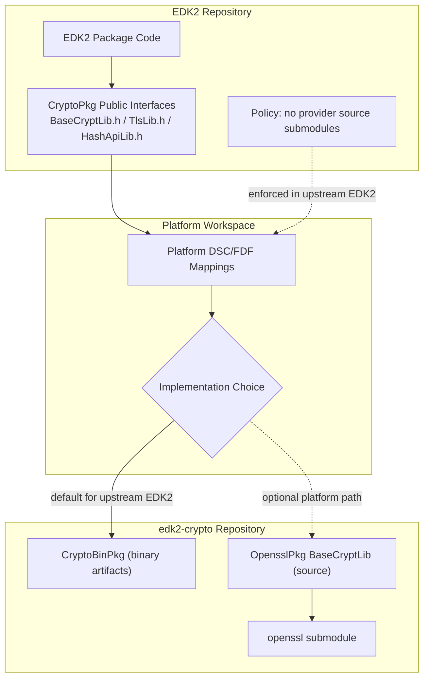

# RFC: EDK2 Crypto Architecture Reorganization

## Metadata

- **RFC Number**: 0002
- **Title**: EDK2 Crypto Architecture Reorganization
- **Status**: Draft

## Change Log

- 2025-12-15: Initial RFC posted at [edk2-crypto](https://github.com/tianocore/edk2-crypto/discussions/2)
- 2026-01-14: Conform to [RFC proposal](https://github.com/tianocore/tianocore-wiki.github.io/pull/5)
- 2026-04-23: Refined architecture split to keep EDK2 interface-only and move provider dependency ownership to edk2-crypto

## Motivation

Today [Edk2/CryptoPkg](https://github.com/tianocore/edk2/tree/master/CryptoPkg) lives entirely in the edk2 source tree.

The current monolithic CryptoPkg architecture creates several challenges:

1. Scattered History - Crypto changes mixed with unrelated EDK2 commits makes security audits difficult
2. Weak Boundaries - Platforms can bypass BaseCryptLib.h and link directly to OpensslLib
    - Example: [TpmLib.inf](https://github.com/tianocore/edk2/blob/9b34b680500bae2880622894c5e217ed792c192b/TcgTpmPkg/Library/TpmLib/TpmLib.inf#L276)
3. Slow Security Response - OpenSSL/MbedTLS patches tied to EDK2 release cycles
4. PQC Readiness - Post-quantum cryptography migration requires architectural agility
5. Coupled CI Pipelines - Crypto validation blocks unrelated EDK2 changes, slowing both crypto and platform development

Therefore, moving crypto providers to a separate `edk2-crypto` repository addresses these by:

- Creating focused git history for security audits
- Enforcing abstraction through physical separation
- Enabling independent security patch releases
- Supporting parallel PQC algorithm experimentation

One consequence of this design is that EDK2 itself cannot consume provider source directly from `edk2-crypto`; it must consume released binary artifacts instead.
This is because `edk2-crypto` carries provider source as submodules, and adding it under EDK2 would introduce a nested submodule layout that is [explicitly not allowed](https://github.com/tianocore/edk2?tab=readme-ov-file#submodules).

This restriction applies to EDK2 repository integration, not to platform workspaces. A platform may still bring in `edk2-crypto` directly, initialize its submodules with `--recursive`, and consume source-based providers where that model makes sense. The intended boundary is that upstream EDK2 remains provider-source free, while platforms may choose either binary or source integration outside the EDK2 tree.

## Technology Background

### BaseCryptLib

EDK2's cryptographic abstraction layer (`BaseCryptLib.h`) provides ~300+ APIs for hashing, encryption, signatures,
TLS, and certificates. Platforms consume it through DSC library mappings. 

### Current Crypto Providers

- **OpensslLib** (`CryptoPkg/Library/OpensslLib/`) - OpenSSL wrapper with UEFI build integration
- **MbedTlsLib** (`CryptoPkg/Library/MbedTlsLib/`) - Smaller footprint alternative
- **CryptoBinPkg** - Prebuilt crypto binaries that implement CryptoPkg public interfaces through OpensslLib or MbedTlsLib

## Goals

1. **Enable Independent Security Response** - Decouple crypto releases from EDK2 cycles
2. **Establish Clear Architectural Boundaries** - All crypto usage through BaseCryptLib.h
3. **Create Focused Git History** - Dedicated repository for crypto changes
4. **Facilitate PQC Migration** - Support algorithm switching without code changes
5. **Support Focused Development** - Crypto experts work in crypto repos
6. **Allow for Source or Binary backings** -  

---

## Requirements

- EDK2 repository builds must be satisfiable without any crypto provider source submodules
- EDK2 repository code must depend only on project-authorized public crypto interfaces (for example BaseCryptLib.h)
- CryptoPkg must continue to provide null instances so interface-only EDK2 builds remain possible
- edk2-crypto must own provider implementation details, including external provider submodules and wrappers
- Both OpensslPkg and MbedTlsPkg must implement BaseCryptLib.h

## UEFI/PI Specification Impact

None. This is an EDK2 reorganization, not a specification change.

## Backward Compatibility

No crypto API changes are required in EDK2. Existing platforms can continue source-based mappings or adopt binary mappings.

## Platform/Package Impact

EDK2 package impact:

- EDK2 package code is expected to consume crypto only through CryptoPkg public interfaces
- Direct provider-specific dependencies in EDK2 packages are considered out-of-model and should be refactored or moved

Platform impact:

- Platforms choose how to satisfy CryptoPkg interfaces (binary, source, or hybrid)
- Platforms can pin crypto independently from EDK2 through edk2-crypto integration
- Platforms are not required to mirror provider source submodules inside EDK2

edk2-crypto repo impact:

- Owns provider wrappers and their dependency control:
  - OpensslPkg
  - MbedTlsPkg
  - CryptoBinPkg
  - External provider submodules (for example openssl, mbedtls)

This keeps dependency details where crypto implementations are maintained.

Why this is beneficial:

- Pin specific versions for reproducible builds
- Update crypto independently of EDK2 releases
- Choose implementation mode through DSC/FDF mappings

## Unresolved Questions

### Security Update Process

How should critical updates be coordinated between edk2-crypto and platforms?

**Action:** Requires separate RFC on security process.

### Versioning Strategy

Should edk2-crypto use semantic versioning independent of EDK2?

**Recommendation:** Use semantic versioning (SemVer) independent of EDK2 release cycles:

- **MAJOR** - Breaking changes in edk2-crypto package contracts or integration model
- **MINOR** - New algorithms/providers or non-breaking package enhancements
- **PATCH** - Security fixes, bug fixes, upstream OpenSSL/MbedTLS updates (no interface changes)

---

## Prior Art/Related Work

[MU Crypto Release](https://github.com/microsoft/mu_crypto_release) serves as a validation testbed for this architecture. It demonstrates the feasibility of separating crypto providers from EDK2, validates the edk2-crypto repository structure and build integration, and prototypes the binary-first consumption model proposed in this RFC.

## Alternatives

### Alternative 1: Keep Everything in EDK2

**Impact:** Maintains current workflow, no submodule complexity.

**Why not chosen:** Does not address core problems:
 - security patches remain slow
 - history remains scattered, architectural
 - boundaries remain weak
 - crypto changes continue to impact EDK2 CI.

### Alternative 2: Move CryptoPkg Entirely to edk2-crypto

**Impact:** Even cleaner separation, EDK2 has zero crypto code.

**Why not chosen:** BaseCryptLib.h interface is part of EDK2's platform contract. Keeping the interface in EDK2 maintains
API stability while allowing implementation flexibility. This alternative may be considered in future iterations.

### Alternative 3: Create Separate Repos for OpensslPkg and MbedTlsPkg

**Impact:** Maximum separation, each crypto provider has its own release cycle.

**Why not chosen:** Adds significant coordination complexity. The edk2-crypto umbrella repository provides a middle
ground - focused crypto history while maintaining manageable dependency structure.

---

## Implementation Design

### What Stays in EDK2 (CryptoPkg)

- Interface definitions (BaseCryptLib.h, TlsLib.h, HashApiLib.h)
- Crypto drivers (CryptoPei, CryptoDxe, CryptoSmm, CryptoStandaloneMm) brought in as a external dependency
- Null implementations (BaseCryptLibNull)
- Package-level policy that EDK2 code uses crypto abstractions, not provider internals

### What Moves to edk2-crypto

- **OpensslPkg** - OpenSSL-based BaseCryptLib + OpensslLib + IntrinsicLib
- **MbedTlsPkg** - MbedTLS-based BaseCryptLib + MbedTlsLib + IntrinsicLib
- **CryptoBinPkg** - Prebuilt crypto binaries that implement CryptoPkg public interfaces
- Provider dependency control (external source submodules such as OpenSSL and MbedTLS)

Each Crypto provider package would be responsible for implementing the BaseCryptLib contract
that remained in EDK2 CryptoPkg.

### Repository Structure

```txt
edk2-crypto/
├── CryptoBinPkg/
│   ├── Driver/
│   ├── Library/
│   └── CryptoBinPkg.dec
├── OpensslPkg/
│   ├── Library/
│   │   ├── BaseCryptLib/
│   │   ├── OpensslLib/
│   │   │   └── openssl/      (submodule)
│   │   └── IntrinsicLib/
│   ├── OpensslPkg.dec
│   └── OpensslPkg.dsc
└── MbedTlsPkg/
    ├── Library/
    │   ├── BaseCryptLib/
    │   ├── MbedTlsLib /
    │   │   └── mbedtls/      (submodule)
    │   └── IntrinsicLib/
    ├── MbedTlsPkg.dec
    └── MbedTlsPkg.dsc

```

### Proposed Architecture

The proposed model keeps EDK2 interface-focused while satisfying crypto needs from `edk2-crypto` artifacts:

- Upstream EDK2 consumes CryptoPkg interfaces and resolves implementations through `CryptoBinPkg` binary artifacts
- Provider source trees remain owned by `edk2-crypto` and are not mirrored into EDK2
- Platform workspaces may optionally integrate `edk2-crypto` source providers directly (for example OpenSSL-backed BaseCryptLib) outside the EDK2 tree




### DSC Migration Example

**General case (binary-first, recommended for most platforms):**

```ini
# Before
[LibraryClasses]
  BaseCryptLib|CryptoPkg/Library/BaseCryptLib/BaseCryptLib.inf

# After
[LibraryClasses]
  BaseCryptLib|CryptoBinPkg/Library/BaseCryptLib/BaseCryptLib.inf
```

**Optional source-based customization (for platforms with specific needs):**

```ini
# After (OpenSSL source)
[LibraryClasses]
  BaseCryptLib|OpensslPkg/Library/BaseCryptLib/BaseCryptLib.inf

# Or (MbedTLS source)
[LibraryClasses]
  BaseCryptLib|MbedTlsPkg/Library/BaseCryptLib/BaseCryptLib.inf
```

The binary-first path is recommended for upstream EDK2 and general platform usage. Source-based mappings are available for platforms requiring direct control over crypto implementation or with specific security/compliance requirements.

### Platform Consumption Models

Platforms can adopt one of the following patterns while still depending on CryptoPkg interfaces from EDK2:

1. **Pure Binary Path**: Interfaces from EDK2 CryptoPkg (for example BaseCryptLib), implementation from edk2-crypto binary (CryptoBinPkg)
2. **Pure Source Path**: Interfaces from EDK2 CryptoPkg, implementation from edk2-crypto source providers (OpensslPkg, MbedTlsPkg, and similar)
3. **Hybrid Path**: Interfaces from EDK2 CryptoPkg, implementation from a combination of edk2-crypto binary plus additional platform-selected crypto code

Recommendation: use the edk2-crypto binary path wherever possible. Some platforms may require hybrid usage to meet specific security objectives.

---

## Testing Strategy

### edk2-crypto CI

- Build OpensslPkg/MbedTlsPkg across architectures (IA32, X64, AARCH64, ARM) and toolchains
- Run BaseCryptLibUnitTest for interface compliance
- Verify provider parity where applicable

### Platform Integration

- OVMF as primary validation (Secure Boot, authenticated variables, TLS)
- Parallel builds during transition to verify equivalence

---

## Migration/Adoption Plan

### Phase 1: Initial Implementation (~1 month)

- Migrate OpensslLib/MbedTlsLib to OpensslPkg/MbedTlsPkg in edk2-crypto
- Establish CI pipelines

### Phase 2: EDK2 Integration (~2-3 months)

- Keep EDK2 provider-source free and continue supporting interface-only/null builds
- Update OVMF and ArmVirtPkg as reference implementations for binary-first integration
- Platform migration: integrate edk2-crypto in platform workspace, update PACKAGES_PATH, update DSC/FDF mappings

### Phase 3: Long-term Maintenance

- Independent release cycles with semantic versioning
- Coordinated security disclosure process

### Risk Mitigation

| Risk                                | Mitigation                              |
|-------------------------------------|-----------------------------------------|
| Interface changes during transition | Freeze BaseCryptLib.h during migration  |
| CI issues                           | Document manual build/test procedures   |
| Integration complexity              | Provide setup scripts and documentation |

---

## Guide-Level Explanation

### For Package Developers

- No code changes required - BaseCryptLib.h unchanged and remains the contract
- Crypto changes happen in edk2-crypto, opaque to EDK2 mainline
  - This allows history to be easier to view and experiment with branches
- Cannot directly reference OpensslLib/MbedTlsLib from EDK2 packages without hurdles
- EDK2 package work that bypasses CryptoPkg abstractions should be refactored or relocated

### For Platform Developers

Migration steps:

1. Integrate edk2-crypto in the platform workspace (submodule, vendor mirror, or package feed)
2. Update PACKAGES_PATH to include edk2-crypto
3. Update DSC/FDF mappings to CryptoBinPkg, OpensslPkg, MbedTlsPkg, or hybrid combinations
4. Verify builds and platform security test coverage

### For End Users

This reorganization is **transparent to end users** - firmware behavior remains identical:

- **No visible changes** - Boot experience, Secure Boot, and all crypto-dependent features work exactly as before
- **No new capabilities exposed** - This is an internal architecture change, not a feature addition
- **No required user actions** - Firmware updates from vendors will incorporate changes seamlessly
